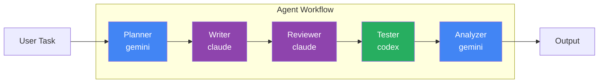
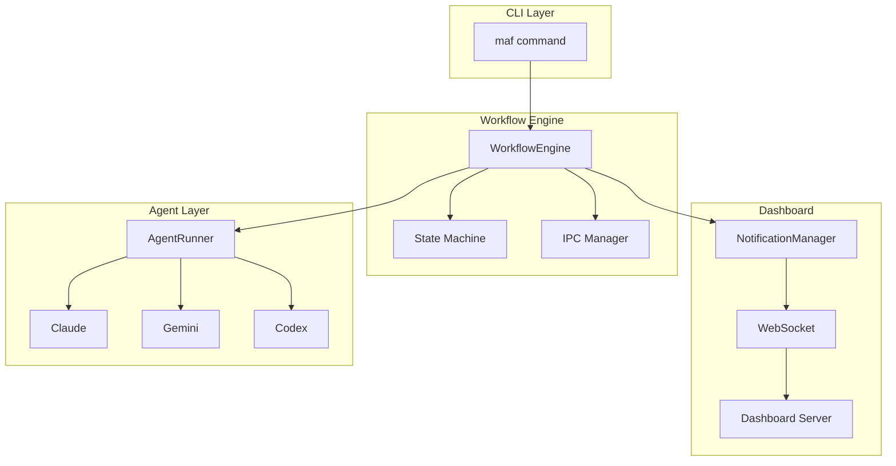

<div align="center">

# Supercode

### Multi-Agent AI Development Framework

[](https://www.python.org/downloads/)
[](https://opensource.org/licenses/MIT)
[](https://github.com/astral-sh/ruff)

**여러 AI 에이전트가 협력하여 복잡한 개발 작업을 자율적으로 수행하는 프레임워크**

[Features](#-features) | [Installation](#-installation) | [Quick Start](#-quick-start) | [Documentation](#-documentation) | [Troubleshooting](#-troubleshooting)

</div>

---

## Overview

Supercode는 Claude, Gemini, Codex 등 다양한 AI CLI 도구들을 통합하여 멀티 에이전트 워크플로우를 구성하는 프레임워크입니다. 각 에이전트가 전문 역할을 담당하며, 중앙 오케스트레이터의 조율 아래 유기적으로 협력합니다.



---

## Features

| Feature | Description |
|---------|-------------|
| **Multi-Agent Collaboration** | 5개 전문 에이전트(Planner, Writer, Reviewer, Tester, Analyzer)가 협력 |
| **Real-time Dashboard** | WebSocket 기반 실시간 워크플로우 모니터링 |
| **Workflow State Management** | 상태 머신 기반 안정적인 워크플로우 관리 |
| **Smart Caching** | 중복 작업 방지를 위한 결과 캐싱 |
| **Flexible CLI** | 직관적인 명령어로 전체 시스템 제어 |

### Supported AI Agents

| Agent | CLI Tool | Role |
|-------|----------|------|
| Planner | `gemini` | 작업 계획 수립 및 분해 |
| Writer | `claude` | 코드 작성 및 구현 |
| Reviewer | `claude` | 코드 리뷰 및 품질 검토 |
| Tester | `codex` | 테스트 실행 및 검증 |
| Analyzer | `gemini` | 결과 분석 및 리포트 생성 |

---

## Prerequisites

### Required

- **Python 3.11+**
- **uv** (권장) 또는 pip

### AI CLI Tools (하나 이상 필요)

```bash
# Claude Code
npm install -g @anthropic-ai/claude-code

# Gemini CLI
npm install -g @anthropic-ai/gemini-cli

# Codex CLI
npm install -g @openai/codex-cli
```

---

## Installation

### Using uv (Recommended)

```bash
# 저장소 클론
git clone https://github.com/anthropics/supercode.git
cd supercode

# uv로 의존성 설치
uv sync

# 패키지 설치 (개발 모드)
uv pip install -e packages/multi-agent-flow
```

### Using pip

```bash
# 저장소 클론
git clone https://github.com/anthropics/supercode.git
cd supercode

# 가상환경 생성 및 활성화
python -m venv .venv
source .venv/bin/activate  # Windows: .venv\Scripts\activate

# 패키지 설치
pip install -e packages/multi-agent-flow
```

### Verify Installation

```bash
# CLI 설치 확인
maf --help

# 사용 가능한 에이전트 확인
maf agents
```

---

## Quick Start

### 1. Run a Workflow

```bash
# 간단한 워크플로우 실행
maf run "Create a fibonacci function with tests"
```

### 2. Monitor with Dashboard

```bash
# 대시보드 서버 시작 (별도 터미널)
maf dashboard --port 8100

# 대시보드와 함께 워크플로우 실행
maf run "Implement user authentication API" --dashboard
```

### 3. Check Status

```bash
# 워크플로우 목록 확인
maf wf-list

# 특정 워크플로우 상태 확인
maf wf-status <task-id>
```

---

## Documentation

### CLI Command Reference

<details>
<summary><b>Workflow Commands</b></summary>

| Command | Description | Example |
|---------|-------------|---------|
| `maf run <task>` | 워크플로우 실행 | `maf run "Add login feature"` |
| `maf run <task> --dashboard` | 대시보드와 함께 실행 | `maf run "Fix bug" -d` |
| `maf wf-status <id>` | 워크플로우 상태 확인 | `maf wf-status abc123` |
| `maf wf-list` | 모든 워크플로우 목록 | `maf wf-list` |

</details>

<details>
<summary><b>Dashboard Commands</b></summary>

| Command | Description | Example |
|---------|-------------|---------|
| `maf dashboard` | 대시보드 서버 시작 | `maf dashboard` |
| `maf dashboard --port <port>` | 특정 포트로 시작 | `maf dashboard --port 8200` |
| `maf monitor` | 터미널 모니터링 | `maf monitor` |

</details>

<details>
<summary><b>Agent Commands</b></summary>

| Command | Description | Example |
|---------|-------------|---------|
| `maf agents` | 사용 가능한 에이전트 확인 | `maf agents` |
| `maf launch` | 에이전트 터미널 실행 | `maf launch` |
| `maf start` | 백엔드 에이전트 시작 | `maf start` |
| `maf stop` | 모든 에이전트 중지 | `maf stop` |
| `maf status` | 에이전트 상태 확인 | `maf status` |

</details>

<details>
<summary><b>Cache Commands</b></summary>

| Command | Description | Example |
|---------|-------------|---------|
| `maf cache` | 캐시 상태 확인 | `maf cache` |
| `maf cache clear` | 캐시 삭제 | `maf cache clear` |

</details>

### Architecture



### Configuration

설정 파일 및 데이터는 `~/.multi-agent-flow/`에 저장됩니다:

```
~/.multi-agent-flow/
├── runs/           # 워크플로우 실행 데이터
├── states/         # 워크플로우 상태
├── cache/          # 결과 캐시
├── logs/           # 로그 파일
└── pids/           # 프로세스 ID
```

### Environment Variables

| Variable | Description | Default |
|----------|-------------|---------|
| `MAF_LOG_LEVEL` | 로그 레벨 (DEBUG, INFO, WARNING, ERROR) | `INFO` |
| `MAF_TIMEOUT` | 에이전트 타임아웃 (초) | `120` |
| `MAF_DASHBOARD_PORT` | 대시보드 포트 | `8100` |

---

## Troubleshooting

### Agent Not Found

```
Error: Agent executable not found: claude
```

**해결방법:**
```bash
# Claude CLI 설치 확인
which claude

# 설치되지 않은 경우
npm install -g @anthropic-ai/claude-code
```

### Agent Timeout

```
Error: Process timed out after 120 seconds
```

**해결방법:**
1. 네트워크 연결 확인
2. API 키 설정 확인
3. 타임아웃 증가: `maf run "task" --timeout 300`

### WebSocket Connection Failed

```
Error: WebSocket connection failed
```

**해결방법:**
```bash
# 대시보드 서버가 실행 중인지 확인
curl http://localhost:8100/health

# 포트 충돌 확인
lsof -i :8100

# 다른 포트로 실행
maf dashboard --port 8200
```

### Permission Denied

```
Error: Permission denied: ~/.multi-agent-flow/
```

**해결방법:**
```bash
# 디렉토리 권한 수정
chmod -R 755 ~/.multi-agent-flow/
```

### Cache Issues

캐시된 결과로 인해 예상과 다른 결과가 나오는 경우:

```bash
# 캐시 삭제
maf cache clear

# 캐시 없이 실행
maf run "task" --no-cache
```

---

## Development

### Setup Development Environment

```bash
# 개발 의존성 설치
uv sync --all-extras

# 또는 pip 사용
pip install -e "packages/multi-agent-flow[dev]"
```

### Running Tests

```bash
# 전체 테스트 실행
pytest packages/multi-agent-flow/tests/

# 특정 테스트 실행
pytest packages/multi-agent-flow/tests/test_workflow.py -v

# 커버리지 포함
pytest --cov=multi_agent_flow packages/multi-agent-flow/tests/
```

### Code Quality

```bash
# 포맷팅
ruff format .

# 린트
ruff check .

# 타입 체크
mypy packages/multi-agent-flow/src/
```

---

## Project Structure

```
supercode/
├── pyproject.toml                 # Workspace configuration
├── packages/
│   └── multi-agent-flow/          # Main package
│       ├── pyproject.toml
│       └── src/
│           └── multi_agent_flow/
│               ├── cli.py         # CLI commands
│               ├── agents/        # Agent runner & config
│               │   ├── config.py
│               │   └── runner.py
│               ├── workflow/      # Workflow engine
│               │   ├── engine.py
│               │   ├── state.py
│               │   └── ipc.py
│               ├── dashboard/     # Real-time dashboard
│               │   ├── server.py
│               │   └── notifications.py
│               └── shared/        # Shared utilities
│                   └── events.py
└── README.md
```

---

## Contributing

기여를 환영합니다! 다음 단계를 따라주세요:

1. Fork the repository
2. Create a feature branch (`git checkout -b feature/amazing-feature`)
3. Commit your changes (`git commit -m 'Add amazing feature'`)
4. Push to the branch (`git push origin feature/amazing-feature`)
5. Open a Pull Request

### Guidelines

- 코드 스타일: `ruff format` 사용
- 테스트: 새 기능에 대한 테스트 추가
- 커밋 메시지: [Conventional Commits](https://www.conventionalcommits.org/) 형식 사용

---

## License

This project is licensed under the MIT License - see the [LICENSE](LICENSE) file for details.

---

<div align="center">

**[Back to top](#supercode)**

Made with Claude Code

</div>
