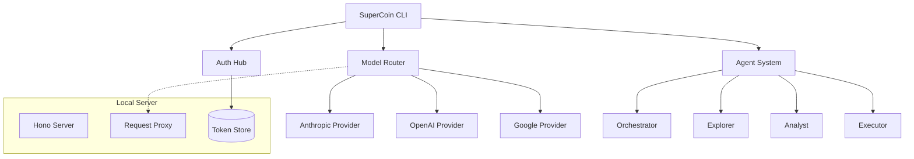

# SuperCoin

> Unified AI CLI hub for Claude, Codex, and Gemini

## Overview

SuperCoin is a multi-provider AI CLI tool that integrates authentication and model access for Claude (Anthropic), Codex (OpenAI), and Gemini (Google) into a single unified interface with advanced agent orchestration capabilities.

## Features

### Multi-Provider Authentication
- **Claude (Anthropic)** - API key authentication
- **Codex (OpenAI)** - API key authentication
- **Gemini (Google)** - API key + OAuth/PKCE support
- **Unified Auth Hub** - Single command to manage all providers

### Model Router
- **Automatic Fallback** - Graceful degradation when models are unavailable
- **Model Aliases** - Shortcuts like `claude`, `gemini`, `gpt`
- **Context-Aware Routing** - Automatically selects optimal model for tasks

### Agent System
6 specialized agents with orchestration:

| Agent | Model | Capabilities |
|-------|--------|--------------|
| **Orchestrator** | Claude Sonnet 4.5 | Request classification, task planning |
| **Explorer** | Claude Haiku 4.5 | Code navigation, search, discovery |
| **Analyst** | Gemini 3 Flash | Large context analysis (1M tokens) |
| **Executor** | GPT-5.2 | Command execution, tool usage |
| **Code Reviewer** | Claude Opus 4.5 | Deep code review, quality analysis |
| **Doc Writer** | Gemini 3 Pro | Documentation generation |

### Hook System
- **Pre/Post hooks** - Lifecycle events for workflows
- **Built-in hooks**: Context injection, tool truncation, TODO continuation, logging
- **Extensible** - Register custom hooks for custom behavior

### Tool System
- **LSP Tools** - hover, definition, references, diagnostics, document symbols
- **Search Tools** - grep, glob for code exploration
- **File Tools** - read, write, edit for code manipulation
- **Session Tools** - session management, message history

### Background Tasks
- **Parallel Execution** - Run multiple agents concurrently
- **Concurrency Limits** - Provider-specific limits for rate management
- **Progress Tracking** - Real-time task status
- **Queue Management** - Automatic task queuing when limits reached

## Installation

```bash
# Clone repository
git clone https://github.com/supercent/supercoin.git
cd supercoin

# Install dependencies
npm install

# Link globally (optional)
npm link
```

## Quick Start

### 1. Authentication

```bash
# Authenticate with all providers interactively
supercoin auth login

# Authenticate with specific provider
supercoin auth login --claude
supercoin auth login --codex
supercoin auth login --gemini

# Check authentication status
supercoin auth status
```

### 2. Model Selection

```bash
# List available models
supercoin models list

# Get model details
supercoin models info anthropic/claude-opus-4-5

# Set default model
supercoin models set-default anthropic/claude-sonnet-4-5

# Use specific model for single request
supercoin -m openai/gpt-5.2 "What's the weather?"
```

### 3. Basic Chat

```bash
# Default model chat
supercoin "Hello, world!"

# Specific model
supercoin -m claude "Help me write code"

# Temperature and tokens
supercoin --temperature 0.5 --max-tokens 1000 "Generate a short story"
```

### 4. Agent Usage

```bash
# List available agents
supercoin agent list

# Spawn background task
supercoin agent spawn explorer "Find all TypeScript files"
supercoin agent spawn analyst "Analyze code complexity"

# Check task status
supercoin agent status <task-id>

# List all background tasks
supercoin agent status
```

### 5. Server Management

```bash
# Start local server (background)
supercoin server start

# Check server status
supercoin server status

# Stop server
supercoin server stop

# View server configuration
supercoin server config get
```

### 6. Configuration

```bash
# View configuration
supercoin config

# Get specific key
supercoin config get default_model

# Set configuration
supercoin config set default_model anthropic/claude-opus-4-5

# Configuration priority (highest to lowest):
# 1. CLI arguments (e.g., --model)
# 2. Environment variables (SUPERCOIN_DEFAULT_MODEL)
# 3. Project config (.supercoin/config.json)
# 4. User config (~/.config/supercoin/config.json)
# 5. Built-in defaults
```

### 7. Health Check

```bash
# Run diagnostics
supercoin doctor
```

## Architecture



## Model Aliases

| Alias | Full Model ID |
|-------|--------------|
| `claude` | `anthropic/claude-sonnet-4-5` |
| `sonnet` | `anthropic/claude-sonnet-4-5` |
| `opus` | `anthropic/claude-opus-4-5` |
| `haiku` | `anthropic/claude-haiku-4-5` |
| `gpt` | `openai/gpt-5.2` |
| `gpt-5` | `openai/gpt-5.2` |
| `o1` | `openai/o1` |
| `gemini` | `google/gemini-3-flash` |
| `flash` | `google/gemini-3-flash` |
| `pro` | `google/gemini-3-pro` |

## Configuration File

`.supercoin/config.json`:

```json
{
  "default_model": "anthropic/claude-sonnet-4-5",
  "fallback_models": [
    "openai/gpt-5.2",
    "google/gemini-3-flash"
  ],
  "providers": {
    "anthropic": {
      "enabled": true,
      "apiKey": "sk-ant-...",
      "baseUrl": "https://api.anthropic.com"
    },
    "openai": {
      "enabled": true,
      "apiKey": "sk-...",
      "baseUrl": "https://api.openai.com"
    },
    "google": {
      "enabled": true,
      "apiKey": "...",
      "baseUrl": "https://generativelanguage.googleapis.com"
    }
  },
  "agents": {
    "explorer": {
      "model": "anthropic/claude-haiku-4-5",
      "disabled": false
    },
    "analyst": {
      "model": "google/gemini-3-flash",
      "disabled": false
    }
  },
  "disabled_hooks": [],
  "server": {
    "port": 3100,
    "host": "127.0.0.1",
    "autoStart": true
  }
}
```

## Development

```bash
# Install dependencies
npm install

# Run in development mode
npm run dev

# Build for production
npm run build

# Run tests
npm test

# Type check
npm run lint
```

## Project Structure

```
supercoin/
├── src/
│   ├── cli/              # CLI commands
│   ├── config/            # Configuration management
│   ├── core/              # Hooks, tools, sessions
│   ├── providers/         # Model providers
│   ├── server/            # HTTP server & routes
│   ├── services/
│   │   ├── auth/         # Authentication providers
│   │   ├── models/       # Model router & providers
│   │   └── agents/       # Agent system
│   ├── shared/            # Utilities (logger, errors)
│   └── supercoin.ts      # Main API class
├── tests/
│   ├── unit/             # Unit tests
│   ├── integration/       # Integration tests
│   └── e2e/             # End-to-end tests
├── examples/             # Sample applications
└── package.json
```

## Technology Stack

- **Runtime**: Node.js / Bun
- **Language**: TypeScript 5.3+
- **CLI Framework**: Commander.js 12.0
- **TUI**: @clack/prompts
- **Validation**: Zod 3.22
- **HTTP Server**: Hono 4.0
- **Testing**: Bun test

## Security

- **Token Storage**: AES-256-GCM encrypted storage
- **TLS 1.3**: All external API requests
- **Local Server**: Binds to localhost only (127.0.0.1)
- **No Cloud Exposure**: No external access to tokens or data

## License

MIT License - see LICENSE file for details

## Contributing

Contributions are welcome! Please:
1. Fork the repository
2. Create a feature branch
3. Make your changes
4. Add tests
5. Submit a pull request

## Roadmap

- [ ] MCP (Model Context Protocol) integration
- [ ] Skill system for custom automation
- [ ] Plugin system for extensibility
- [ ] Streaming responses in CLI
- [ ] Web UI (optional)
- [ ] More model providers

## Related Projects

- [oh-my-opencode](https://github.com/anthropics/oh-my-opencode) - Plugin architecture reference
- [Claude Code Documentation](https://docs.anthropic.com/claude-code)
- [OpenAI API Docs](https://platform.openai.com/docs)
- [Google AI Docs](https://ai.google.dev/docs)
