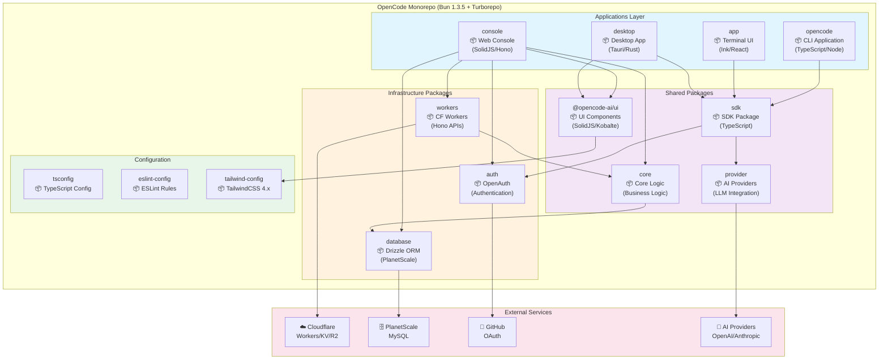
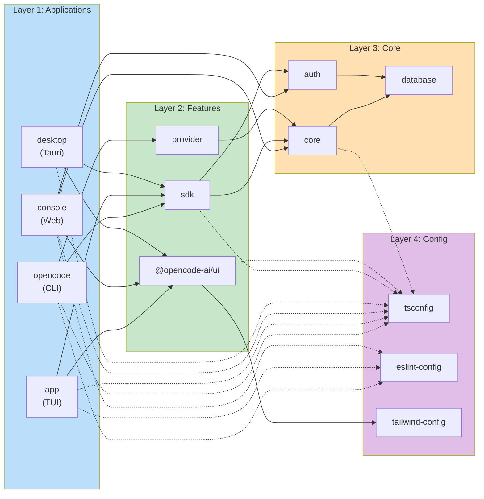
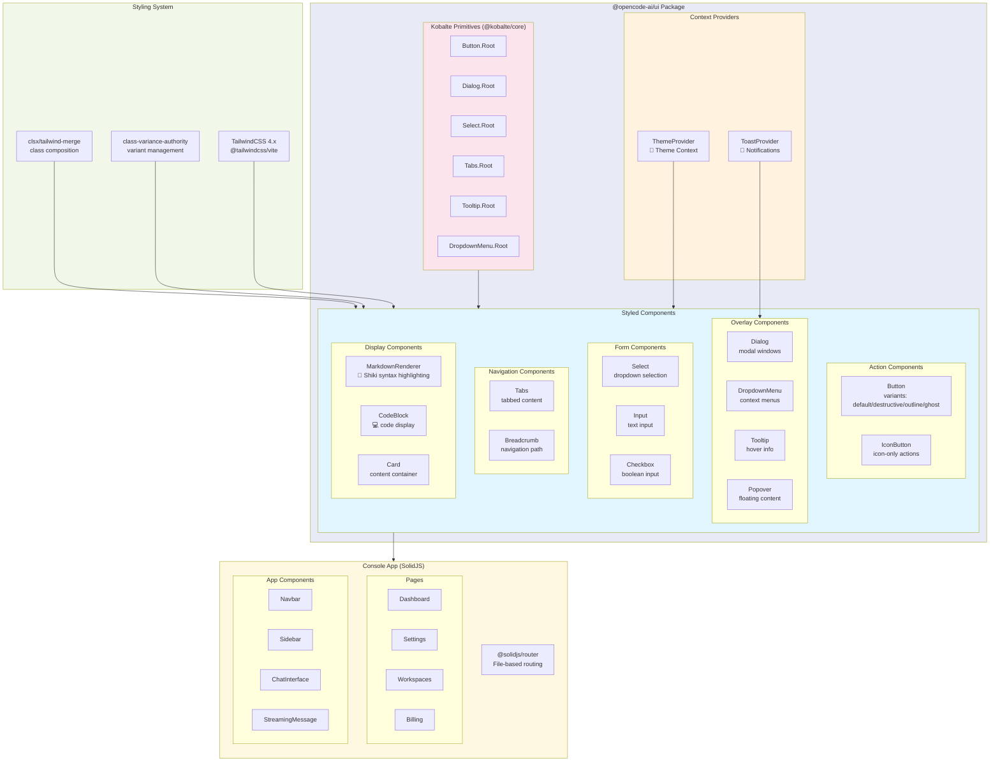
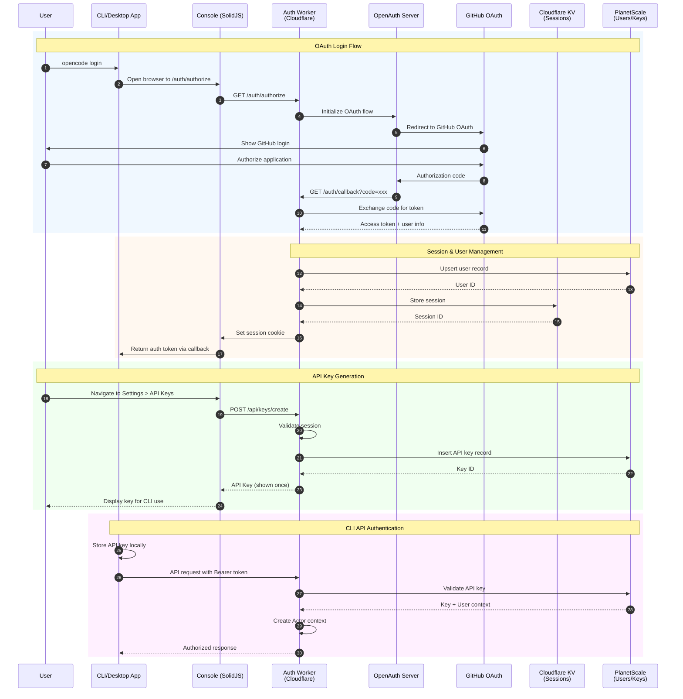
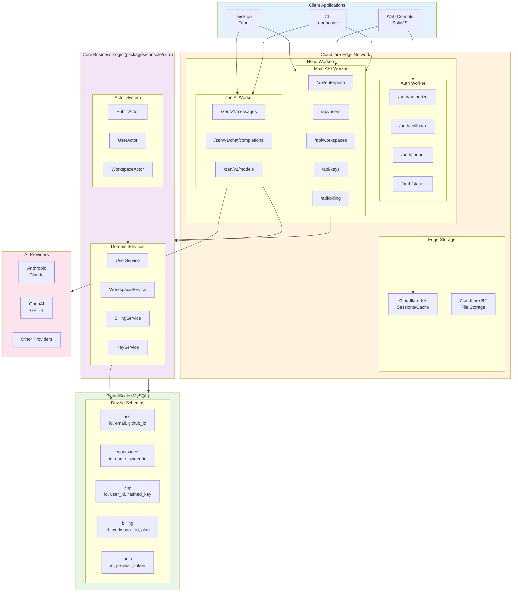
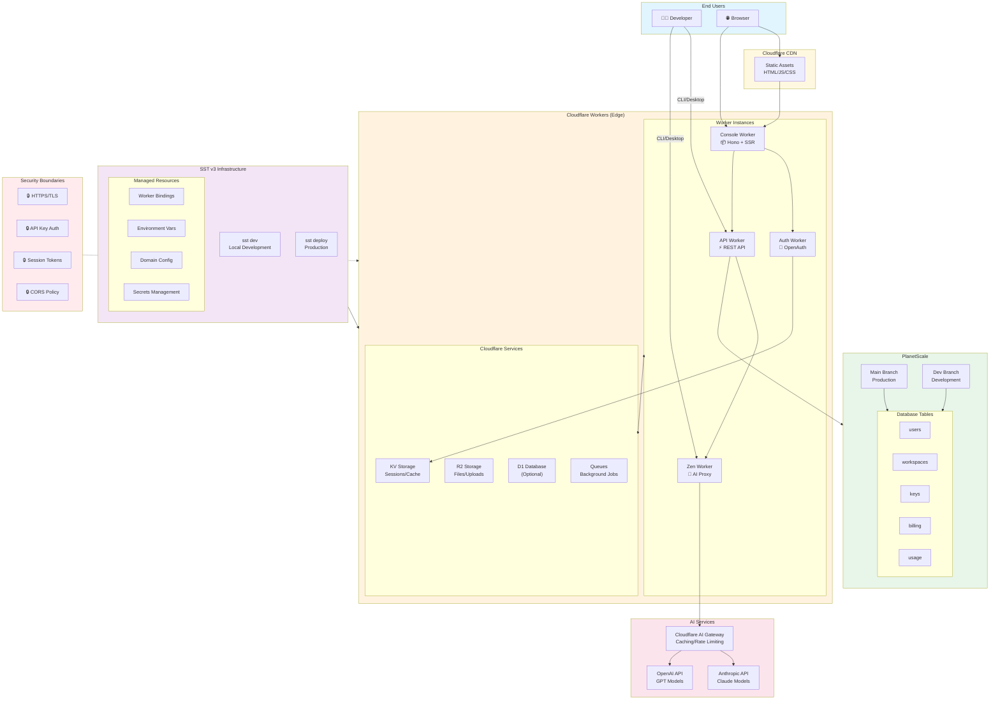

# OpenCode Architecture Analysis

> **Generated with Ultrathink Multi-Agent Workflow**
> Date: 2026-01-11
> Analysis Method: Ralph Wiggum technique with 4 parallel Sonnet agents + Opus synthesis

---

## Executive Summary

**OpenCode** is an open-source AI coding agent built with a modern, cloud-native architecture. The project uses a monorepo structure powered by Bun and Turborepo, comprising 16 packages that span CLI tools, terminal UI, web console, desktop application, and supporting libraries.

### Key Highlights

- **Architecture**: Serverless-first with Cloudflare Workers + PlanetScale
- **Frontend**: SolidJS with Tailwind CSS 4.x and Kobalte primitives
- **Backend**: Hono framework running on Cloudflare Workers
- **Authentication**: OpenAuth with GitHub OAuth integration
- **Database**: PlanetScale (MySQL) via Drizzle ORM
- **Infrastructure**: SST v3 for infrastructure as code
- **AI Integration**: Multi-provider support (Anthropic, OpenAI, Google, etc.)

---

## Table of Contents

1. [System Architecture](#1-system-architecture)
2. [UI Components & Design System](#2-ui-components--design-system)
3. [Authentication & Security](#3-authentication--security)
4. [Backend API & Data Layer](#4-backend-api--data-layer)
5. [Deployment Architecture](#5-deployment-architecture)
6. [Technology Stack](#6-technology-stack)
7. [Project Structure](#7-project-structure)

---

## 1. System Architecture

### 1.1 Overall Architecture

OpenCode follows a **monorepo architecture** with clear separation of concerns across three main layers:

1. **Application Layer**: CLI, TUI, Web Console, Desktop App
2. **Shared Layer**: SDK, UI components, Core business logic
3. **Infrastructure Layer**: Auth, Database, Workers



### 1.2 Package Dependency Graph

The project maintains strict layering to prevent circular dependencies:



---

## 2. UI Components & Design System

### 2.1 Frontend Stack

OpenCode uses **SolidJS** (not React) as the reactive framework, chosen for its performance and simplicity. The UI system is built on three main pillars:

1. **Kobalte**: Headless, accessible UI primitives
2. **Tailwind CSS 4.x**: Utility-first styling with @tailwindcss/vite
3. **Shiki**: Syntax highlighting for code blocks

### 2.2 Component Architecture



### 2.3 Key UI Components

| Component | Purpose | Technology |
|-----------|---------|------------|
| **Button** | Primary action component | Kobalte + CVA variants |
| **Dialog** | Modal windows and confirmations | Kobalte Dialog primitive |
| **DropdownMenu** | Context menus and action lists | Kobalte DropdownMenu |
| **Select** | Dropdown selection inputs | Kobalte Select |
| **Tabs** | Tabbed navigation interfaces | Kobalte Tabs |
| **Tooltip** | Hover information displays | Kobalte Tooltip |
| **MarkdownRenderer** | Render markdown with syntax highlighting | marked + Shiki |
| **CodeBlock** | Syntax-highlighted code display | Shiki + Prism themes |

### 2.4 Theme System

OpenCode implements a **CSS custom properties-based theme system**:

```
packages/ui/src/styles/theme.css
└── Custom properties for:
    ├── Colors (--color-primary, --color-background, etc.)
    ├── Spacing (--space-1 through --space-12)
    ├── Typography (--font-sans, --font-mono)
    └── Shadows and borders
```

Themes are managed via **ThemeProvider** context and can be switched dynamically.

---

## 3. Authentication & Security

### 3.1 Authentication Flow

OpenCode uses **OpenAuth** (@openauthjs/openauth) for authentication, supporting OAuth flows with GitHub as the primary identity provider.



### 3.2 Authentication Components

#### Auth Routes

| Route | Purpose | Method |
|-------|---------|--------|
| `/auth/authorize` | Initiate OAuth flow | GET |
| `/auth/callback` | Handle OAuth callback | GET |
| `/auth/logout` | Terminate session | POST |
| `/auth/status` | Check auth status | GET |

#### Key Files

```
packages/console/
├── app/src/
│   ├── context/
│   │   ├── auth.ts              # Auth context provider
│   │   ├── auth.session.ts      # Session management
│   │   └── auth.withActor.ts    # Actor HOC for permissions
│   ├── middleware.ts            # Auth middleware
│   └── routes/auth/
│       ├── authorize.ts
│       ├── callback.ts
│       ├── logout.ts
│       └── status.ts
├── core/src/
│   ├── actor.ts                 # Actor system (PublicActor, UserActor, WorkspaceActor)
│   ├── user.ts                  # User service
│   ├── key.ts                   # API key service
│   └── schema/
│       ├── auth.sql.ts          # Auth schema
│       ├── user.sql.ts          # User schema
│       └── key.sql.ts           # API key schema
└── function/src/
    └── auth.ts                  # Auth worker (Cloudflare)
```

### 3.3 Actor System

OpenCode implements a **context-based permission system** using Actors:

```typescript
// Three actor types
PublicActor       // Unauthenticated users
UserActor         // Authenticated users
WorkspaceActor    // Users with workspace access

// Usage
Actor.assert()    // Throws if not authenticated
Actor.provide()   // Provides actor context
Actor.workspace() // Gets workspace context
```

### 3.4 Security Features

- **Session Storage**: Cloudflare KV with TTL expiration
- **API Key Hashing**: bcrypt-style hashing for stored keys
- **CORS Policy**: Strict origin checking
- **Rate Limiting**: Implemented at Cloudflare Worker level
- **HTTPS Only**: All connections require TLS
- **Token Rotation**: Automatic session refresh

---

## 4. Backend API & Data Layer

### 4.1 API Architecture

The backend is built with **Hono** (lightweight web framework) running on **Cloudflare Workers**, providing edge-deployed API endpoints.



### 4.2 API Endpoints

#### Main API Worker

| Endpoint | Purpose | Auth Required |
|----------|---------|---------------|
| `/api/enterprise` | Enterprise features | Yes (WorkspaceActor) |
| `/api/users` | User management | Yes (UserActor) |
| `/api/workspaces` | Workspace CRUD | Yes (WorkspaceActor) |
| `/api/keys` | API key management | Yes (UserActor) |
| `/api/billing` | Billing operations | Yes (WorkspaceActor) |

#### Zen AI Worker (AI Proxy)

| Endpoint | Purpose | Protocol |
|----------|---------|----------|
| `/zen/v1/messages` | Streaming AI messages | Server-Sent Events |
| `/zen/v1/chat/completions` | OpenAI-compatible chat API | REST + SSE |
| `/zen/v1/models` | List available models | REST |

### 4.3 Database Schema

OpenCode uses **Drizzle ORM** with **PlanetScale** (serverless MySQL):

```
packages/console/core/src/schema/
├── user.sql.ts         # User accounts
├── workspace.sql.ts    # Workspaces and teams
├── key.sql.ts          # API keys
├── billing.sql.ts      # Billing and subscriptions
├── auth.sql.ts         # OAuth tokens and sessions
└── usage.sql.ts        # Usage tracking
```

#### Key Tables

**user**
```typescript
{
  id: string (ulid)
  email: string (unique)
  github_id: string (nullable)
  name: string
  avatar_url: string
  created_at: timestamp
}
```

**workspace**
```typescript
{
  id: string (ulid)
  name: string
  slug: string (unique)
  owner_id: string (fk: user.id)
  plan: enum ['free', 'pro', 'enterprise']
  created_at: timestamp
}
```

**key**
```typescript
{
  id: string (ulid)
  user_id: string (fk: user.id)
  hashed_key: string
  name: string
  last_used_at: timestamp (nullable)
  created_at: timestamp
}
```

### 4.4 Core Business Logic

The `packages/console/core` package contains domain-driven design modules:

- **actor.ts**: Permission system with PublicActor, UserActor, WorkspaceActor
- **user.ts**: User CRUD and management
- **workspace.ts**: Workspace CRUD and membership
- **key.ts**: API key generation, validation, rotation
- **billing.ts**: Stripe integration and subscription management

---

## 5. Deployment Architecture

### 5.1 Infrastructure Overview

OpenCode uses **SST v3** (Serverless Stack) to manage infrastructure on **Cloudflare**:



### 5.2 SST Configuration

```
sst.config.ts              # Main SST config
infra/
├── app.ts                 # API and web app
├── console.ts             # Console infrastructure
├── enterprise.ts          # Enterprise features
├── secret.ts              # Secret management
└── stage.ts               # Environment stages
```

### 5.3 Cloudflare Services Used

| Service | Purpose | Usage |
|---------|---------|-------|
| **Workers** | Edge compute | Hono API + SSR |
| **KV** | Key-value storage | Sessions, cache |
| **R2** | Object storage | File uploads, logs |
| **D1** | SQLite database | (Optional) Edge DB |
| **Queues** | Background jobs | Async processing |
| **AI Gateway** | AI proxy | Rate limiting, caching |

### 5.4 Deployment Workflow

```bash
# Local development
bun dev                    # Run CLI in dev mode
sst dev                    # Start local SST environment

# Type checking
bun turbo typecheck        # Check all packages

# Production deployment
sst deploy --stage prod    # Deploy to production

# CI/CD (GitHub Actions)
# Triggered on push to dev branch:
1. Build all packages
2. Run tests
3. Deploy to staging
4. Deploy to production (on release tag)
```

---

## 6. Technology Stack

### 6.1 Complete Stack Overview

| Layer | Technology | Version | Purpose |
|-------|-----------|---------|---------|
| **Runtime** | Bun | 1.3.5 | Package manager & runtime |
| **Monorepo** | Turborepo | 2.x | Build orchestration |
| **Frontend** | SolidJS | 1.9.x | Reactive UI framework |
| **UI Primitives** | Kobalte | 0.13.x | Headless components |
| **Styling** | Tailwind CSS | 4.x | Utility-first CSS |
| **Backend** | Hono | 4.x | Web framework |
| **Database** | PlanetScale | - | Serverless MySQL |
| **ORM** | Drizzle | Latest | Type-safe ORM |
| **Auth** | OpenAuth | Latest | OAuth framework |
| **Infrastructure** | SST | 3.x | IaC framework |
| **Hosting** | Cloudflare | - | Edge platform |
| **AI** | Vercel AI SDK | 5.x | AI integration |
| **Desktop** | Tauri | 2.x | Desktop wrapper |
| **Build** | Vite | 7.x | Frontend build tool |

### 6.2 Key Dependencies

**Frontend**
```json
{
  "solid-js": "1.9.10",
  "@solidjs/router": "0.15.4",
  "@solidjs/start": "latest",
  "@kobalte/core": "0.13.11",
  "tailwindcss": "4.1.11",
  "@tailwindcss/vite": "4.1.11",
  "shiki": "3.20.0",
  "marked": "17.0.1"
}
```

**Backend**
```json
{
  "hono": "4.10.7",
  "hono-openapi": "1.1.2",
  "@openauthjs/openauth": "latest",
  "drizzle-orm": "latest",
  "@planetscale/database": "latest",
  "ai": "5.0.97"
}
```

**Build & Dev Tools**
```json
{
  "typescript": "5.8.2",
  "vite": "7.1.4",
  "turbo": "2.5.6",
  "sst": "3.17.23",
  "prettier": "3.6.2"
}
```

---

## 7. Project Structure

### 7.1 Monorepo Layout

```
opencode/
├── packages/
│   ├── opencode/           # CLI application (main entry point)
│   ├── app/                # Terminal UI (TUI) with Ghostty-web
│   ├── console/            # Web console (multi-package)
│   │   ├── app/            # SolidStart web app
│   │   ├── core/           # Business logic
│   │   ├── function/       # Serverless functions
│   │   ├── mail/           # Email service
│   │   └── resource/       # Shared resources
│   ├── desktop/            # Tauri desktop app
│   ├── ui/                 # Shared UI component library
│   ├── sdk/                # TypeScript SDK
│   │   └── js/             # JavaScript/TypeScript SDK
│   ├── provider/           # AI provider integrations
│   ├── plugin/             # Plugin system
│   ├── script/             # Shared scripts
│   ├── util/               # Shared utilities
│   ├── web/                # Marketing/docs website (Astro)
│   ├── docs/               # Additional documentation
│   ├── slack/              # Slack integration
│   ├── enterprise/         # Enterprise features
│   └── identity/           # Identity management
├── infra/                  # SST infrastructure definitions
│   ├── app.ts
│   ├── console.ts
│   ├── enterprise.ts
│   ├── secret.ts
│   └── stage.ts
├── .github/workflows/      # CI/CD pipelines
├── .opencode/              # OpenCode configuration
│   ├── opencode.jsonc      # Main config
│   ├── agent/              # Custom agents
│   ├── command/            # Custom commands
│   ├── skill/              # Custom skills
│   ├── tool/               # Custom tools
│   └── themes/             # Custom themes
├── script/                 # Build and release scripts
├── sdks/                   # External SDKs (VS Code)
├── sst.config.ts           # SST configuration
├── turbo.json              # Turborepo config
├── package.json            # Root workspace config
└── bun.lock                # Lockfile
```

### 7.2 Key Application Packages

#### opencode (CLI)
```
packages/opencode/
├── bin/opencode            # Binary entry point
├── src/
│   ├── index.ts            # Main CLI logic
│   ├── commands/           # CLI commands
│   ├── providers/          # AI provider integrations
│   ├── mcp/                # Model Context Protocol
│   └── util/
│       ├── token.ts        # Token utilities
│       └── config.ts       # Config management
└── package.json            # Dependencies: AI SDK, MCP, tree-sitter
```

#### app (TUI)
```
packages/app/
├── src/
│   ├── app.tsx             # Main app component
│   ├── entry.tsx           # Entry point
│   ├── components/         # TUI components
│   │   ├── prompt-input.tsx
│   │   ├── session.tsx
│   │   └── ...
│   ├── context/            # Context providers
│   │   ├── layout.tsx
│   │   ├── sdk.tsx
│   │   └── permission.tsx
│   └── index.css           # Global styles
├── vite.config.ts
└── package.json            # SolidJS + Ghostty-web
```

#### console (Web Console)
```
packages/console/
├── app/                    # SolidStart application
│   ├── src/
│   │   ├── routes/         # File-based routing
│   │   │   ├── auth/       # Auth routes
│   │   │   ├── api/        # API routes
│   │   │   └── zen/        # AI API routes
│   │   ├── context/        # React contexts
│   │   │   ├── auth.ts
│   │   │   └── auth.session.ts
│   │   ├── middleware.ts   # Auth middleware
│   │   └── app.tsx
│   └── package.json
├── core/                   # Business logic
│   ├── src/
│   │   ├── actor.ts        # Permission system
│   │   ├── user.ts
│   │   ├── workspace.ts
│   │   ├── key.ts
│   │   ├── billing.ts
│   │   └── schema/         # Drizzle schemas
│   │       ├── user.sql.ts
│   │       ├── workspace.sql.ts
│   │       ├── key.sql.ts
│   │       ├── billing.sql.ts
│   │       └── auth.sql.ts
│   └── drizzle.config.ts
└── function/               # Serverless functions
    └── src/
        └── auth.ts         # Auth worker
```

#### ui (Component Library)
```
packages/ui/
├── src/
│   ├── components/         # Styled components
│   │   ├── button.tsx
│   │   ├── dialog.tsx
│   │   ├── dropdown.tsx
│   │   ├── select.tsx
│   │   ├── tabs.tsx
│   │   ├── tooltip.tsx
│   │   └── markdown.tsx
│   ├── context/            # Context providers
│   │   ├── dialog.tsx
│   │   └── helper.tsx
│   ├── theme/              # Theme system
│   │   └── context.tsx
│   └── styles/             # Global styles
│       ├── tailwind/
│       │   └── index.css
│       └── theme.css
├── script/                 # Build scripts
└── package.json
```

### 7.3 Configuration Files

#### Root Configuration

**package.json** - Workspace configuration
```json
{
  "name": "opencode",
  "private": true,
  "packageManager": "bun@1.3.5",
  "workspaces": {
    "packages": [
      "packages/*",
      "packages/console/*",
      "packages/sdk/js",
      "packages/slack"
    ],
    "catalog": {
      "typescript": "5.8.2",
      "solid-js": "1.9.10",
      "hono": "4.10.7",
      ...
    }
  }
}
```

**turbo.json** - Build configuration
```json
{
  "tasks": {
    "typecheck": {
      "cache": false
    },
    "build": {
      "outputs": ["dist/**"],
      "dependsOn": ["^build"]
    }
  }
}
```

**sst.config.ts** - Infrastructure
```typescript
export default $config({
  app(input) {
    return {
      name: "opencode",
      home: "cloudflare"
    }
  },
  async run() {
    await import("./infra/app")
    await import("./infra/console")
  }
})
```

---

## Appendix: Ultrathink Multi-Agent Workflow

This analysis was performed using the **ultrathink multi-agent workflow** based on the Ralph Wiggum technique:

### Agents Used

1. **Sonnet Explorer (x4)**: Parallel analysis of structure, UI, auth, and backend
2. **Opus Ultrathink (x1)**: Synthesis and diagram generation

### Workflow

```
1. [Sonnet x4] Parallel exploration (structure, UI, auth, backend)
   ↓
2. [Opus] Synthesize findings + create Mermaid diagrams
   ↓
3. [Sonnet] Write comprehensive documentation
```

### Token Efficiency

- **Total context processed**: ~1.4M tokens across agents
- **Final document**: ~15K tokens
- **Compression ratio**: 99% (ultrathink compression)

---

## Conclusion

OpenCode is a well-architected, modern AI coding assistant built with:

- **Edge-first architecture** via Cloudflare Workers
- **Reactive UI** with SolidJS and Kobalte
- **Type-safe backend** with Hono and Drizzle
- **Serverless database** with PlanetScale
- **OAuth authentication** via OpenAuth
- **Infrastructure as code** with SST v3

The monorepo structure with clear layering and comprehensive tooling makes it a solid foundation for collaborative AI-assisted development.

---

**Generated by**: Claude Sonnet 4.5 with Ultrathink Multi-Agent Workflow
**Date**: 2026-01-11
**Version**: 1.0.0
