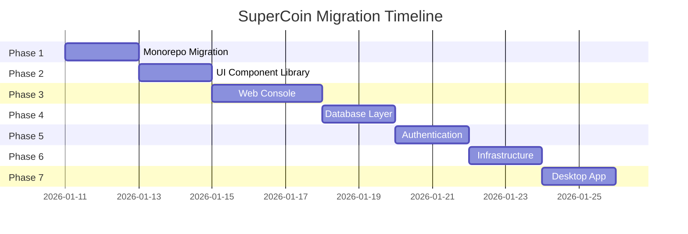

# SuperCoin OpenCode Architecture Migration

> **Project**: SuperCoin CLI to Full-Stack Platform Migration
> **Target Architecture**: OpenCode-style Monorepo with Web Console
> **Date**: 2026-01-11

---

## Executive Summary

이 문서는 SuperCoin CLI 프로젝트를 OpenCode 스타일의 모던 풀스택 아키텍처로 마이그레이션하는 계획을 설명합니다.

### Current State (AS-IS)

| Aspect | Current |
|--------|---------|
| **Structure** | Single Package CLI Application |
| **Runtime** | Bun |
| **Framework** | Commander.js + Hono |
| **UI** | Ink (React-based TUI) |
| **Database** | None (file-based config) |
| **Auth** | Custom OAuth + API Keys |
| **Infrastructure** | Local only |

### Target State (TO-BE)

| Aspect | Target |
|--------|--------|
| **Structure** | Monorepo (Bun + Turborepo) |
| **Runtime** | Bun 1.3.5+ |
| **Framework** | SolidJS + SolidStart + Hono |
| **UI** | Kobalte + Tailwind CSS 4.x |
| **Database** | Drizzle ORM + SQLite/PlanetScale |
| **Auth** | OpenAuth with GitHub OAuth |
| **Infrastructure** | SST v3 + Cloudflare Workers |

---

## Phase Overview



### Phase Details

| Phase | Name | Description | Priority |
|-------|------|-------------|----------|
| 1 | Monorepo Migration | Turborepo 구조로 변환 | High |
| 2 | UI Component Library | @supercoin/ui 패키지 생성 | High |
| 3 | Web Console | SolidStart 웹 콘솔 | High |
| 4 | Database Layer | Drizzle ORM 통합 | High |
| 5 | Authentication | OpenAuth OAuth 시스템 | Medium |
| 6 | Infrastructure | SST + Cloudflare Workers | Medium |
| 7 | Desktop App | Tauri 래퍼 | Low |

---

## Target Monorepo Structure

```
supercoin/
├── packages/
│   ├── cli/                    # CLI Application (existing)
│   │   ├── src/
│   │   └── package.json
│   ├── console/                # Web Console
│   │   ├── app/               # SolidStart app
│   │   ├── core/              # Business logic
│   │   └── function/          # Serverless functions
│   ├── ui/                     # Shared UI components
│   │   ├── src/
│   │   │   ├── components/
│   │   │   └── styles/
│   │   └── package.json
│   ├── desktop/                # Tauri desktop app
│   ├── sdk/                    # TypeScript SDK
│   ├── database/               # Drizzle schemas
│   └── config/                 # Shared configurations
│       ├── tsconfig/
│       ├── eslint/
│       └── tailwind/
├── infra/                      # SST infrastructure
│   ├── console.ts
│   ├── api.ts
│   └── secret.ts
├── turbo.json                  # Turborepo config
├── sst.config.ts               # SST config
├── package.json                # Workspace root
└── bun.lock
```

---

## Technology Stack Mapping

### OpenCode -> SuperCoin

| OpenCode Tech | SuperCoin Implementation |
|---------------|-------------------------|
| SolidJS 1.9.x | SolidJS 1.9.x |
| Kobalte 0.13.x | Kobalte 0.13.x |
| Tailwind CSS 4.x | Tailwind CSS 4.x |
| Hono 4.x | Hono 4.x (already using) |
| Drizzle ORM | Drizzle ORM |
| PlanetScale | SQLite (local) / PlanetScale (prod) |
| OpenAuth | OpenAuth |
| SST v3 | SST v3 |
| Cloudflare Workers | Cloudflare Workers |
| Tauri 2.x | Tauri 2.x |

---

## Success Criteria

### Phase Completion Checklist

- [ ] Phase 1: `turbo build` succeeds with all packages
- [ ] Phase 2: UI components render correctly in Storybook
- [ ] Phase 3: Web console serves at localhost:3000
- [ ] Phase 4: Database migrations run successfully
- [ ] Phase 5: OAuth login flow works end-to-end
- [ ] Phase 6: `sst deploy` succeeds to Cloudflare
- [ ] Phase 7: Desktop app builds and runs on macOS

### Quality Gates

1. **Type Safety**: `turbo typecheck` passes
2. **Tests**: All existing 143 tests continue to pass
3. **Build**: `turbo build` completes without errors
4. **Lint**: ESLint passes with zero errors

---

## Risk Assessment

| Risk | Impact | Mitigation |
|------|--------|------------|
| Breaking existing CLI | High | Gradual migration, maintain backwards compatibility |
| Package version conflicts | Medium | Use workspace catalogs for version management |
| Build complexity | Medium | Start with minimal Turborepo config |
| SST learning curve | Low | Follow OpenCode patterns exactly |

---

## Next Steps

1. Read `docs/plan/01-phase1-monorepo.md` for detailed Phase 1 plan
2. Check `docs/work/01-phase1-progress.md` for implementation progress
3. Run verification commands after each phase

---

**Generated by**: Multi-Agent Workflow (Sisyphus)
**Last Updated**: 2026-01-11
