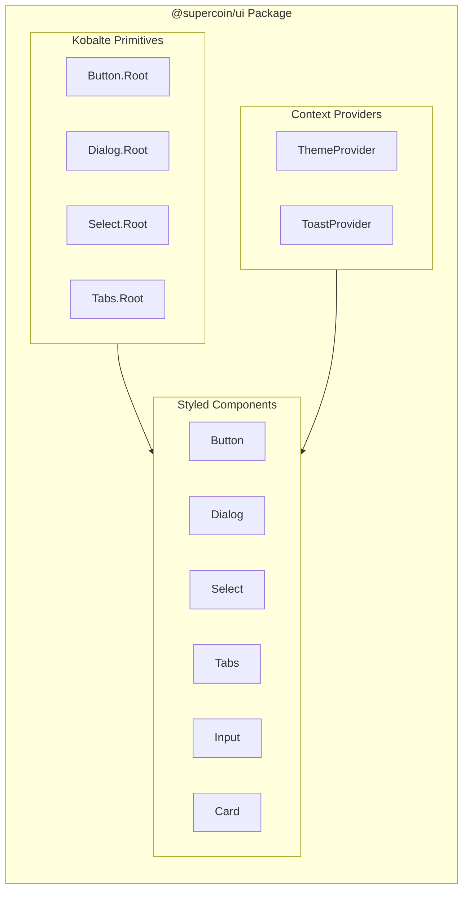

# Phase 2: UI Component Library

> **Phase**: 2 of 7
> **Priority**: High
> **Estimated Duration**: 2 days
> **Dependencies**: Phase 1 (Monorepo Migration)

---

## Objective

OpenCode 스타일의 UI 컴포넌트 라이브러리를 생성합니다. SolidJS + Kobalte + Tailwind CSS 4.x 기반입니다.

---

## Target Architecture



---

## Package Structure

```
packages/ui/
├── src/
│   ├── index.ts                    # Main exports
│   ├── components/
│   │   ├── button.tsx              # Button variants
│   │   ├── dialog.tsx              # Modal dialogs
│   │   ├── dropdown-menu.tsx       # Context menus
│   │   ├── select.tsx              # Dropdown select
│   │   ├── tabs.tsx                # Tabbed navigation
│   │   ├── tooltip.tsx             # Hover tooltips
│   │   ├── input.tsx               # Text inputs
│   │   ├── card.tsx                # Content cards
│   │   ├── markdown.tsx            # Markdown renderer
│   │   └── code-block.tsx          # Syntax highlighting
│   ├── context/
│   │   ├── theme.tsx               # Theme provider
│   │   ├── toast.tsx               # Toast notifications
│   │   └── dialog.tsx              # Dialog state
│   ├── styles/
│   │   ├── tailwind/
│   │   │   └── index.css           # Tailwind entry
│   │   └── theme.css               # CSS custom properties
│   └── utils/
│       ├── cn.ts                   # Class name utility
│       └── variants.ts             # CVA variants
├── package.json
├── tsconfig.json
└── vite.config.ts
```

---

## Implementation Steps

### Step 2.1: Package Setup

**File: `packages/ui/package.json`**
```json
{
  "name": "@supercoin/ui",
  "version": "0.1.0",
  "type": "module",
  "main": "./src/index.ts",
  "types": "./src/index.ts",
  "exports": {
    ".": "./src/index.ts",
    "./button": "./src/components/button.tsx",
    "./dialog": "./src/components/dialog.tsx",
    "./select": "./src/components/select.tsx",
    "./tabs": "./src/components/tabs.tsx",
    "./tooltip": "./src/components/tooltip.tsx",
    "./input": "./src/components/input.tsx",
    "./card": "./src/components/card.tsx",
    "./styles": "./src/styles/tailwind/index.css",
    "./theme": "./src/context/theme.tsx"
  },
  "dependencies": {
    "solid-js": "^1.9.10",
    "@kobalte/core": "^0.13.11",
    "class-variance-authority": "^0.7.1",
    "clsx": "^2.1.1",
    "tailwind-merge": "^2.7.0"
  },
  "devDependencies": {
    "@supercoin/tsconfig": "workspace:*",
    "tailwindcss": "^4.1.11",
    "@tailwindcss/vite": "^4.1.11",
    "vite": "^7.1.4",
    "vite-plugin-solid": "^2.11.6",
    "typescript": "^5.3.3"
  },
  "peerDependencies": {
    "solid-js": "^1.9.0"
  }
}
```

### Step 2.2: Tailwind CSS 4.x Setup

**File: `packages/ui/src/styles/tailwind/index.css`**
```css
@import "tailwindcss";

/* Custom theme variables */
@theme {
  /* Colors */
  --color-background: #ffffff;
  --color-foreground: #0a0a0a;
  --color-primary: #0066ff;
  --color-primary-foreground: #ffffff;
  --color-secondary: #f4f4f5;
  --color-secondary-foreground: #18181b;
  --color-muted: #f4f4f5;
  --color-muted-foreground: #71717a;
  --color-accent: #f4f4f5;
  --color-accent-foreground: #18181b;
  --color-destructive: #ef4444;
  --color-destructive-foreground: #ffffff;
  --color-border: #e4e4e7;
  --color-input: #e4e4e7;
  --color-ring: #0066ff;
  
  /* Border Radius */
  --radius-sm: 0.25rem;
  --radius-md: 0.375rem;
  --radius-lg: 0.5rem;
  --radius-xl: 0.75rem;
  
  /* Shadows */
  --shadow-sm: 0 1px 2px 0 rgb(0 0 0 / 0.05);
  --shadow-md: 0 4px 6px -1px rgb(0 0 0 / 0.1);
  --shadow-lg: 0 10px 15px -3px rgb(0 0 0 / 0.1);
}

/* Dark mode */
@variant dark (&:where(.dark, .dark *)) {
  --color-background: #0a0a0a;
  --color-foreground: #fafafa;
  --color-primary: #3b82f6;
  --color-secondary: #27272a;
  --color-secondary-foreground: #fafafa;
  --color-muted: #27272a;
  --color-muted-foreground: #a1a1aa;
  --color-accent: #27272a;
  --color-accent-foreground: #fafafa;
  --color-border: #27272a;
  --color-input: #27272a;
}
```

### Step 2.3: Class Name Utility

**File: `packages/ui/src/utils/cn.ts`**
```typescript
import { clsx, type ClassValue } from "clsx";
import { twMerge } from "tailwind-merge";

export function cn(...inputs: ClassValue[]) {
  return twMerge(clsx(inputs));
}
```

### Step 2.4: Button Component

**File: `packages/ui/src/components/button.tsx`**
```tsx
import { type JSX, splitProps, type Component } from "solid-js";
import { Button as KobalteButton } from "@kobalte/core/button";
import { cva, type VariantProps } from "class-variance-authority";
import { cn } from "../utils/cn";

const buttonVariants = cva(
  "inline-flex items-center justify-center whitespace-nowrap rounded-md text-sm font-medium ring-offset-background transition-colors focus-visible:outline-none focus-visible:ring-2 focus-visible:ring-ring focus-visible:ring-offset-2 disabled:pointer-events-none disabled:opacity-50",
  {
    variants: {
      variant: {
        default: "bg-primary text-primary-foreground hover:bg-primary/90",
        destructive: "bg-destructive text-destructive-foreground hover:bg-destructive/90",
        outline: "border border-input bg-background hover:bg-accent hover:text-accent-foreground",
        secondary: "bg-secondary text-secondary-foreground hover:bg-secondary/80",
        ghost: "hover:bg-accent hover:text-accent-foreground",
        link: "text-primary underline-offset-4 hover:underline",
      },
      size: {
        default: "h-10 px-4 py-2",
        sm: "h-9 rounded-md px-3",
        lg: "h-11 rounded-md px-8",
        icon: "h-10 w-10",
      },
    },
    defaultVariants: {
      variant: "default",
      size: "default",
    },
  }
);

export interface ButtonProps
  extends JSX.ButtonHTMLAttributes<HTMLButtonElement>,
    VariantProps<typeof buttonVariants> {}

export const Button: Component<ButtonProps> = (props) => {
  const [local, others] = splitProps(props, ["variant", "size", "class"]);
  
  return (
    <KobalteButton.Root
      class={cn(buttonVariants({ variant: local.variant, size: local.size }), local.class)}
      {...others}
    />
  );
};
```

### Step 2.5: Dialog Component

**File: `packages/ui/src/components/dialog.tsx`**
```tsx
import { type JSX, splitProps, type Component, type ParentComponent } from "solid-js";
import { Dialog as KobalteDialog } from "@kobalte/core/dialog";
import { cn } from "../utils/cn";

export const Dialog = KobalteDialog.Root;
export const DialogTrigger = KobalteDialog.Trigger;
export const DialogPortal = KobalteDialog.Portal;

export const DialogOverlay: Component<{ class?: string }> = (props) => {
  return (
    <KobalteDialog.Overlay
      class={cn(
        "fixed inset-0 z-50 bg-black/80 data-[state=open]:animate-in data-[state=closed]:animate-out data-[state=closed]:fade-out-0 data-[state=open]:fade-in-0",
        props.class
      )}
    />
  );
};

export const DialogContent: ParentComponent<{ class?: string }> = (props) => {
  return (
    <DialogPortal>
      <DialogOverlay />
      <KobalteDialog.Content
        class={cn(
          "fixed left-[50%] top-[50%] z-50 grid w-full max-w-lg translate-x-[-50%] translate-y-[-50%] gap-4 border bg-background p-6 shadow-lg duration-200 data-[state=open]:animate-in data-[state=closed]:animate-out data-[state=closed]:fade-out-0 data-[state=open]:fade-in-0 data-[state=closed]:zoom-out-95 data-[state=open]:zoom-in-95 data-[state=closed]:slide-out-to-left-1/2 data-[state=closed]:slide-out-to-top-[48%] data-[state=open]:slide-in-from-left-1/2 data-[state=open]:slide-in-from-top-[48%] sm:rounded-lg",
          props.class
        )}
      >
        {props.children}
      </KobalteDialog.Content>
    </DialogPortal>
  );
};

export const DialogHeader: ParentComponent<{ class?: string }> = (props) => (
  <div class={cn("flex flex-col space-y-1.5 text-center sm:text-left", props.class)}>
    {props.children}
  </div>
);

export const DialogTitle: ParentComponent<{ class?: string }> = (props) => (
  <KobalteDialog.Title class={cn("text-lg font-semibold leading-none tracking-tight", props.class)}>
    {props.children}
  </KobalteDialog.Title>
);

export const DialogDescription: ParentComponent<{ class?: string }> = (props) => (
  <KobalteDialog.Description class={cn("text-sm text-muted-foreground", props.class)}>
    {props.children}
  </KobalteDialog.Description>
);
```

### Step 2.6: Select Component

**File: `packages/ui/src/components/select.tsx`**
```tsx
import { type JSX, splitProps, type Component, type ParentComponent } from "solid-js";
import { Select as KobalteSelect } from "@kobalte/core/select";
import { cn } from "../utils/cn";

export const Select = KobalteSelect.Root;
export const SelectValue = KobalteSelect.Value;

export const SelectTrigger: ParentComponent<{ class?: string }> = (props) => {
  return (
    <KobalteSelect.Trigger
      class={cn(
        "flex h-10 w-full items-center justify-between rounded-md border border-input bg-background px-3 py-2 text-sm ring-offset-background placeholder:text-muted-foreground focus:outline-none focus:ring-2 focus:ring-ring focus:ring-offset-2 disabled:cursor-not-allowed disabled:opacity-50",
        props.class
      )}
    >
      {props.children}
      <KobalteSelect.Icon class="h-4 w-4 opacity-50">
        <svg xmlns="http://www.w3.org/2000/svg" viewBox="0 0 24 24" fill="none" stroke="currentColor" stroke-width="2">
          <path d="m6 9 6 6 6-6"/>
        </svg>
      </KobalteSelect.Icon>
    </KobalteSelect.Trigger>
  );
};

export const SelectContent: ParentComponent<{ class?: string }> = (props) => {
  return (
    <KobalteSelect.Portal>
      <KobalteSelect.Content
        class={cn(
          "relative z-50 min-w-[8rem] overflow-hidden rounded-md border bg-popover text-popover-foreground shadow-md data-[state=open]:animate-in data-[state=closed]:animate-out data-[state=closed]:fade-out-0 data-[state=open]:fade-in-0 data-[state=closed]:zoom-out-95 data-[state=open]:zoom-in-95",
          props.class
        )}
      >
        <KobalteSelect.Listbox class="p-1" />
      </KobalteSelect.Content>
    </KobalteSelect.Portal>
  );
};

export const SelectItem: ParentComponent<{ value: string; class?: string }> = (props) => {
  return (
    <KobalteSelect.Item
      value={props.value}
      class={cn(
        "relative flex w-full cursor-default select-none items-center rounded-sm py-1.5 pl-8 pr-2 text-sm outline-none focus:bg-accent focus:text-accent-foreground data-[disabled]:pointer-events-none data-[disabled]:opacity-50",
        props.class
      )}
    >
      <span class="absolute left-2 flex h-3.5 w-3.5 items-center justify-center">
        <KobalteSelect.ItemIndicator>
          <svg xmlns="http://www.w3.org/2000/svg" viewBox="0 0 24 24" fill="none" stroke="currentColor" stroke-width="2" class="h-4 w-4">
            <polyline points="20 6 9 17 4 12"/>
          </svg>
        </KobalteSelect.ItemIndicator>
      </span>
      <KobalteSelect.ItemLabel>{props.children}</KobalteSelect.ItemLabel>
    </KobalteSelect.Item>
  );
};
```

### Step 2.7: Theme Provider

**File: `packages/ui/src/context/theme.tsx`**
```tsx
import { createContext, createSignal, useContext, type ParentComponent } from "solid-js";

type Theme = "light" | "dark" | "system";

interface ThemeContextValue {
  theme: () => Theme;
  setTheme: (theme: Theme) => void;
  resolvedTheme: () => "light" | "dark";
}

const ThemeContext = createContext<ThemeContextValue>();

export const ThemeProvider: ParentComponent<{ defaultTheme?: Theme }> = (props) => {
  const [theme, setTheme] = createSignal<Theme>(props.defaultTheme ?? "system");
  
  const resolvedTheme = () => {
    const current = theme();
    if (current === "system") {
      return window.matchMedia("(prefers-color-scheme: dark)").matches ? "dark" : "light";
    }
    return current;
  };
  
  // Apply theme to document
  const applyTheme = () => {
    const resolved = resolvedTheme();
    document.documentElement.classList.remove("light", "dark");
    document.documentElement.classList.add(resolved);
  };
  
  // Watch for theme changes
  createEffect(() => {
    applyTheme();
  });
  
  return (
    <ThemeContext.Provider value={{ theme, setTheme, resolvedTheme }}>
      {props.children}
    </ThemeContext.Provider>
  );
};

export function useTheme() {
  const context = useContext(ThemeContext);
  if (!context) {
    throw new Error("useTheme must be used within ThemeProvider");
  }
  return context;
}
```

### Step 2.8: Main Exports

**File: `packages/ui/src/index.ts`**
```typescript
// Components
export * from "./components/button";
export * from "./components/dialog";
export * from "./components/select";
export * from "./components/tabs";
export * from "./components/tooltip";
export * from "./components/input";
export * from "./components/card";

// Context
export * from "./context/theme";
export * from "./context/toast";

// Utilities
export { cn } from "./utils/cn";
```

---

## Component Specifications

| Component | Kobalte Primitive | Variants |
|-----------|-------------------|----------|
| Button | Button.Root | default, destructive, outline, secondary, ghost, link |
| Dialog | Dialog.Root | - |
| Select | Select.Root | - |
| Tabs | Tabs.Root | - |
| Tooltip | Tooltip.Root | - |
| DropdownMenu | DropdownMenu.Root | - |

---

## Verification Commands

```bash
# 1. Install dependencies
bun install

# 2. Type check UI package
bun turbo typecheck --filter=@supercoin/ui

# 3. Build UI package
bun turbo build --filter=@supercoin/ui

# 4. Start dev server (for testing)
cd packages/ui && bun run dev
```

---

## Success Criteria

- [ ] All Kobalte-based components render correctly
- [ ] Tailwind CSS 4.x compiles without errors
- [ ] Theme switching works (light/dark)
- [ ] Components are accessible (keyboard navigation)
- [ ] TypeScript types are correctly exported
- [ ] CVA variants work as expected

---

**Previous**: [Phase 1: Monorepo Migration](./01-phase1-monorepo.md)
**Next**: [Phase 3: Web Console](./03-phase3-web-console.md)
