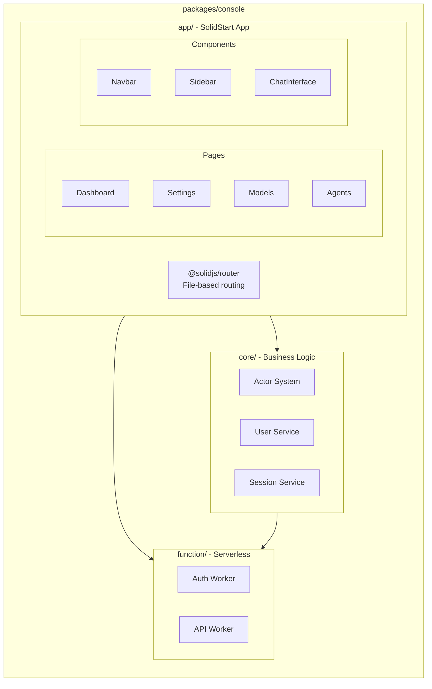

# Phase 3: Web Console

> **Phase**: 3 of 7
> **Priority**: High
> **Estimated Duration**: 3 days
> **Dependencies**: Phase 1 (Monorepo), Phase 2 (UI Library)

---

## Objective

SolidStart 기반의 웹 콘솔 애플리케이션을 생성합니다. 관리 대시보드, 설정, 인증 UI를 제공합니다.

---

## Target Architecture



---

## Package Structure

```
packages/console/
├── app/                        # SolidStart application
│   ├── src/
│   │   ├── routes/             # File-based routing
│   │   │   ├── index.tsx       # Dashboard
│   │   │   ├── models/
│   │   │   │   └── index.tsx   # Model management
│   │   │   ├── agents/
│   │   │   │   └── index.tsx   # Agent management
│   │   │   ├── settings/
│   │   │   │   └── index.tsx   # Settings page
│   │   │   ├── auth/
│   │   │   │   ├── login.tsx   # Login page
│   │   │   │   └── callback.tsx # OAuth callback
│   │   │   └── api/            # API routes
│   │   │       ├── health.ts
│   │   │       └── [...path].ts
│   │   ├── components/         # App-specific components
│   │   │   ├── layout/
│   │   │   │   ├── navbar.tsx
│   │   │   │   ├── sidebar.tsx
│   │   │   │   └── footer.tsx
│   │   │   ├── chat/
│   │   │   │   ├── chat-input.tsx
│   │   │   │   ├── chat-message.tsx
│   │   │   │   └── chat-interface.tsx
│   │   │   └── dashboard/
│   │   │       ├── stats-card.tsx
│   │   │       └── activity-feed.tsx
│   │   ├── context/            # App context providers
│   │   │   ├── auth.tsx
│   │   │   └── session.tsx
│   │   ├── lib/                # Utilities
│   │   │   └── api.ts
│   │   ├── entry-client.tsx
│   │   ├── entry-server.tsx
│   │   └── app.tsx             # Root component
│   ├── public/                 # Static assets
│   ├── app.config.ts           # SolidStart config
│   ├── vite.config.ts
│   ├── package.json
│   └── tsconfig.json
├── core/                       # Business logic (shared)
│   ├── src/
│   │   ├── index.ts
│   │   ├── actor.ts            # Permission system
│   │   ├── user.ts             # User service
│   │   ├── session.ts          # Session service
│   │   └── schema/             # Drizzle schemas (Phase 4)
│   ├── package.json
│   └── tsconfig.json
└── function/                   # Serverless functions
    ├── src/
    │   ├── auth.ts             # Auth worker
    │   └── api.ts              # API worker
    ├── package.json
    └── tsconfig.json
```

---

## Implementation Steps

### Step 3.1: SolidStart App Setup

**File: `packages/console/app/package.json`**
```json
{
  "name": "@supercoin/console-app",
  "version": "0.1.0",
  "type": "module",
  "scripts": {
    "dev": "vinxi dev",
    "build": "vinxi build",
    "start": "vinxi start"
  },
  "dependencies": {
    "@solidjs/router": "^0.15.4",
    "@solidjs/start": "^1.1.1",
    "@supercoin/ui": "workspace:*",
    "solid-js": "^1.9.10",
    "vinxi": "^0.6.3"
  },
  "devDependencies": {
    "@supercoin/tsconfig": "workspace:*",
    "@tailwindcss/vite": "^4.1.11",
    "tailwindcss": "^4.1.11",
    "typescript": "^5.3.3",
    "vite": "^7.1.4",
    "vite-plugin-solid": "^2.11.6"
  }
}
```

### Step 3.2: Vite Configuration

**File: `packages/console/app/vite.config.ts`**
```typescript
import { defineConfig } from "vite";
import { solidStart } from "@solidjs/start/config";
import tailwindcss from "@tailwindcss/vite";

export default defineConfig({
  plugins: [
    solidStart(),
    tailwindcss(),
  ],
  ssr: {
    noExternal: ["@kobalte/core", "@supercoin/ui"]
  }
});
```

### Step 3.3: App Configuration

**File: `packages/console/app/app.config.ts`**
```typescript
import { defineConfig } from "@solidjs/start/config";

export default defineConfig({
  server: {
    preset: "cloudflare-pages",
  },
  vite: {
    ssr: {
      noExternal: ["@kobalte/core"]
    }
  }
});
```

### Step 3.4: Root App Component

**File: `packages/console/app/src/app.tsx`**
```tsx
import { Router } from "@solidjs/router";
import { FileRoutes } from "@solidjs/start/router";
import { Suspense } from "solid-js";
import { ThemeProvider } from "@supercoin/ui/theme";
import "@supercoin/ui/styles";
import "./app.css";

export default function App() {
  return (
    <ThemeProvider defaultTheme="system">
      <Router
        root={(props) => (
          <Suspense fallback={<div>Loading...</div>}>
            {props.children}
          </Suspense>
        )}
      >
        <FileRoutes />
      </Router>
    </ThemeProvider>
  );
}
```

### Step 3.5: Layout Components

**File: `packages/console/app/src/components/layout/navbar.tsx`**
```tsx
import { Component } from "solid-js";
import { A } from "@solidjs/router";
import { Button } from "@supercoin/ui/button";
import { useTheme } from "@supercoin/ui/theme";

export const Navbar: Component = () => {
  const { theme, setTheme, resolvedTheme } = useTheme();
  
  return (
    <header class="sticky top-0 z-50 w-full border-b bg-background/95 backdrop-blur supports-[backdrop-filter]:bg-background/60">
      <div class="container flex h-14 items-center">
        <div class="mr-4 flex">
          <A href="/" class="mr-6 flex items-center space-x-2">
            <span class="font-bold">SuperCoin</span>
          </A>
          <nav class="flex items-center space-x-6 text-sm font-medium">
            <A href="/models" class="transition-colors hover:text-foreground/80">
              Models
            </A>
            <A href="/agents" class="transition-colors hover:text-foreground/80">
              Agents
            </A>
            <A href="/settings" class="transition-colors hover:text-foreground/80">
              Settings
            </A>
          </nav>
        </div>
        <div class="flex flex-1 items-center justify-end space-x-2">
          <Button
            variant="ghost"
            size="icon"
            onClick={() => setTheme(resolvedTheme() === "dark" ? "light" : "dark")}
          >
            {resolvedTheme() === "dark" ? "🌙" : "☀️"}
          </Button>
        </div>
      </div>
    </header>
  );
};
```

**File: `packages/console/app/src/components/layout/sidebar.tsx`**
```tsx
import { Component, For } from "solid-js";
import { A, useLocation } from "@solidjs/router";
import { cn } from "@supercoin/ui";

const navItems = [
  { href: "/", label: "Dashboard", icon: "📊" },
  { href: "/models", label: "Models", icon: "🤖" },
  { href: "/agents", label: "Agents", icon: "🕵️" },
  { href: "/sessions", label: "Sessions", icon: "💬" },
  { href: "/settings", label: "Settings", icon: "⚙️" },
];

export const Sidebar: Component = () => {
  const location = useLocation();
  
  return (
    <aside class="hidden w-64 shrink-0 border-r md:block">
      <div class="flex h-full flex-col gap-2 p-4">
        <For each={navItems}>
          {(item) => (
            <A
              href={item.href}
              class={cn(
                "flex items-center gap-3 rounded-lg px-3 py-2 text-sm font-medium transition-colors",
                location.pathname === item.href
                  ? "bg-secondary text-secondary-foreground"
                  : "text-muted-foreground hover:bg-secondary hover:text-secondary-foreground"
              )}
            >
              <span>{item.icon}</span>
              {item.label}
            </A>
          )}
        </For>
      </div>
    </aside>
  );
};
```

### Step 3.6: Dashboard Page

**File: `packages/console/app/src/routes/index.tsx`**
```tsx
import { Component, For, createResource } from "solid-js";
import { Card } from "@supercoin/ui/card";
import { Navbar } from "~/components/layout/navbar";
import { Sidebar } from "~/components/layout/sidebar";

interface Stats {
  totalChats: number;
  activeModels: number;
  activeAgents: number;
  tokensUsed: number;
}

async function fetchStats(): Promise<Stats> {
  // TODO: Connect to API
  return {
    totalChats: 1234,
    activeModels: 5,
    activeAgents: 6,
    tokensUsed: 50000,
  };
}

export default function Dashboard() {
  const [stats] = createResource(fetchStats);
  
  const statCards = () => [
    { label: "Total Chats", value: stats()?.totalChats ?? 0, icon: "💬" },
    { label: "Active Models", value: stats()?.activeModels ?? 0, icon: "🤖" },
    { label: "Active Agents", value: stats()?.activeAgents ?? 0, icon: "🕵️" },
    { label: "Tokens Used", value: stats()?.tokensUsed ?? 0, icon: "🔢" },
  ];
  
  return (
    <div class="flex min-h-screen flex-col">
      <Navbar />
      <div class="flex flex-1">
        <Sidebar />
        <main class="flex-1 p-6">
          <h1 class="mb-6 text-3xl font-bold">Dashboard</h1>
          <div class="grid gap-4 md:grid-cols-2 lg:grid-cols-4">
            <For each={statCards()}>
              {(stat) => (
                <Card class="p-6">
                  <div class="flex items-center justify-between">
                    <span class="text-2xl">{stat.icon}</span>
                    <span class="text-2xl font-bold">{stat.value.toLocaleString()}</span>
                  </div>
                  <p class="mt-2 text-sm text-muted-foreground">{stat.label}</p>
                </Card>
              )}
            </For>
          </div>
        </main>
      </div>
    </div>
  );
}
```

### Step 3.7: Models Page

**File: `packages/console/app/src/routes/models/index.tsx`**
```tsx
import { Component, For, createSignal } from "solid-js";
import { Card } from "@supercoin/ui/card";
import { Button } from "@supercoin/ui/button";
import { Select, SelectTrigger, SelectContent, SelectItem, SelectValue } from "@supercoin/ui/select";
import { Navbar } from "~/components/layout/navbar";
import { Sidebar } from "~/components/layout/sidebar";

const providers = [
  { id: "anthropic", name: "Anthropic", models: ["claude-sonnet-4", "claude-3.5-sonnet", "claude-3.5-haiku"] },
  { id: "openai", name: "OpenAI", models: ["gpt-4o", "gpt-4o-mini", "o1", "o1-mini"] },
  { id: "google", name: "Google", models: ["gemini-2.0-flash", "gemini-1.5-pro", "gemini-1.5-flash"] },
  { id: "ollama", name: "Ollama", models: ["llama3", "gemma2", "qwen", "phi"] },
];

export default function ModelsPage() {
  const [selectedProvider, setSelectedProvider] = createSignal("anthropic");
  const [selectedModel, setSelectedModel] = createSignal("claude-sonnet-4");
  
  const currentProvider = () => providers.find(p => p.id === selectedProvider());
  
  return (
    <div class="flex min-h-screen flex-col">
      <Navbar />
      <div class="flex flex-1">
        <Sidebar />
        <main class="flex-1 p-6">
          <h1 class="mb-6 text-3xl font-bold">Models</h1>
          
          <div class="grid gap-6 md:grid-cols-2">
            <Card class="p-6">
              <h2 class="mb-4 text-xl font-semibold">Model Selection</h2>
              
              <div class="space-y-4">
                <div>
                  <label class="mb-2 block text-sm font-medium">Provider</label>
                  <Select
                    value={selectedProvider()}
                    onChange={setSelectedProvider}
                    options={providers.map(p => p.id)}
                    itemComponent={(props) => (
                      <SelectItem value={props.item.rawValue}>
                        {providers.find(p => p.id === props.item.rawValue)?.name}
                      </SelectItem>
                    )}
                  >
                    <SelectTrigger>
                      <SelectValue<string>>
                        {(state) => providers.find(p => p.id === state.selectedOption())?.name}
                      </SelectValue>
                    </SelectTrigger>
                    <SelectContent />
                  </Select>
                </div>
                
                <div>
                  <label class="mb-2 block text-sm font-medium">Model</label>
                  <Select
                    value={selectedModel()}
                    onChange={setSelectedModel}
                    options={currentProvider()?.models ?? []}
                    itemComponent={(props) => (
                      <SelectItem value={props.item.rawValue}>
                        {props.item.rawValue}
                      </SelectItem>
                    )}
                  >
                    <SelectTrigger>
                      <SelectValue<string>>
                        {(state) => state.selectedOption()}
                      </SelectValue>
                    </SelectTrigger>
                    <SelectContent />
                  </Select>
                </div>
                
                <Button class="w-full">Save as Default</Button>
              </div>
            </Card>
            
            <Card class="p-6">
              <h2 class="mb-4 text-xl font-semibold">Available Providers</h2>
              <div class="space-y-3">
                <For each={providers}>
                  {(provider) => (
                    <div class="flex items-center justify-between rounded-lg border p-3">
                      <div>
                        <p class="font-medium">{provider.name}</p>
                        <p class="text-sm text-muted-foreground">
                          {provider.models.length} models
                        </p>
                      </div>
                      <span class="rounded-full bg-green-100 px-2 py-1 text-xs text-green-700">
                        Active
                      </span>
                    </div>
                  )}
                </For>
              </div>
            </Card>
          </div>
        </main>
      </div>
    </div>
  );
}
```

### Step 3.8: Core Business Logic

**File: `packages/console/core/package.json`**
```json
{
  "name": "@supercoin/console-core",
  "version": "0.1.0",
  "type": "module",
  "main": "./src/index.ts",
  "types": "./src/index.ts",
  "exports": {
    ".": "./src/index.ts",
    "./actor": "./src/actor.ts",
    "./user": "./src/user.ts"
  },
  "dependencies": {
    "@supercoin/shared": "workspace:*",
    "zod": "^3.22.4"
  },
  "devDependencies": {
    "@supercoin/tsconfig": "workspace:*",
    "typescript": "^5.3.3"
  }
}
```

**File: `packages/console/core/src/actor.ts`**
```typescript
import { createContext } from "solid-js";

export type ActorType = "public" | "user" | "workspace";

export interface PublicActor {
  type: "public";
}

export interface UserActor {
  type: "user";
  properties: {
    userId: string;
    email: string;
  };
}

export interface WorkspaceActor {
  type: "workspace";
  properties: {
    userId: string;
    workspaceId: string;
  };
}

export type Actor = PublicActor | UserActor | WorkspaceActor;

export function createPublicActor(): PublicActor {
  return { type: "public" };
}

export function createUserActor(userId: string, email: string): UserActor {
  return {
    type: "user",
    properties: { userId, email },
  };
}

export function assertUser(actor: Actor): asserts actor is UserActor {
  if (actor.type !== "user") {
    throw new Error("User authentication required");
  }
}

export function assertWorkspace(actor: Actor): asserts actor is WorkspaceActor {
  if (actor.type !== "workspace") {
    throw new Error("Workspace access required");
  }
}
```

---

## API Routes

### Health Check

**File: `packages/console/app/src/routes/api/health.ts`**
```typescript
import { APIEvent } from "@solidjs/start/server";

export function GET(event: APIEvent) {
  return Response.json({
    status: "ok",
    timestamp: new Date().toISOString(),
    version: "0.1.0",
  });
}
```

### API Proxy

**File: `packages/console/app/src/routes/api/[...path].ts`**
```typescript
import { APIEvent } from "@solidjs/start/server";

export async function GET(event: APIEvent) {
  const path = event.params.path;
  // Forward to backend API
  return Response.json({ path, method: "GET" });
}

export async function POST(event: APIEvent) {
  const path = event.params.path;
  const body = await event.request.json();
  return Response.json({ path, method: "POST", body });
}
```

---

## Verification Commands

```bash
# 1. Install dependencies
bun install

# 2. Type check console packages
bun turbo typecheck --filter=@supercoin/console-app --filter=@supercoin/console-core

# 3. Start development server
cd packages/console/app
bun run dev

# 4. Open browser
open http://localhost:3000

# 5. Test API endpoint
curl http://localhost:3000/api/health
```

---

## Success Criteria

- [ ] SolidStart app runs at localhost:3000
- [ ] File-based routing works correctly
- [ ] UI components from @supercoin/ui render properly
- [ ] Theme switching works (dark/light mode)
- [ ] Navbar and Sidebar navigation work
- [ ] Dashboard displays mock data
- [ ] API routes respond correctly
- [ ] SSR works without errors

---

**Previous**: [Phase 2: UI Component Library](./02-phase2-ui-library.md)
**Next**: [Phase 4: Database Layer](./04-phase4-database.md)
