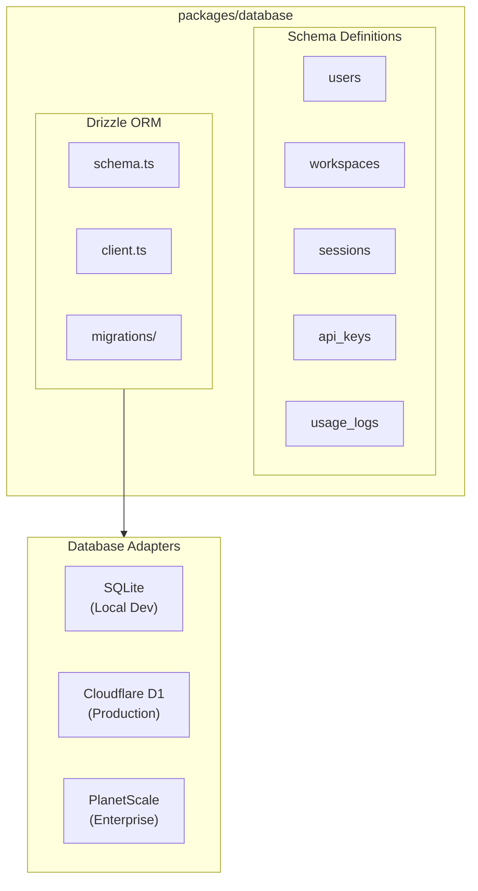

# Phase 4: Database Layer

> **Phase**: 4 of 7
> **Priority**: High
> **Estimated Duration**: 2 days
> **Dependencies**: Phase 3 (Web Console)

---

## Objective

Drizzle ORM을 통합하여 SQLite (로컬 개발) 및 PlanetScale/D1 (프로덕션)을 지원하는 데이터베이스 레이어를 구축합니다.

---

## Target Architecture



---

## Package Structure

```
packages/database/
├── src/
│   ├── index.ts                # Main exports
│   ├── client.ts               # Database client factory
│   ├── schema/
│   │   ├── index.ts            # Schema exports
│   │   ├── user.ts             # User table
│   │   ├── workspace.ts        # Workspace table
│   │   ├── session.ts          # Session table
│   │   ├── key.ts              # API key table
│   │   ├── usage.ts            # Usage tracking
│   │   └── relations.ts        # Table relations
│   └── migrations/             # Generated migrations
├── drizzle.config.ts           # Drizzle Kit config
├── package.json
└── tsconfig.json
```

---

## Implementation Steps

### Step 4.1: Package Setup

**File: `packages/database/package.json`**
```json
{
  "name": "@supercoin/database",
  "version": "0.1.0",
  "type": "module",
  "main": "./src/index.ts",
  "types": "./src/index.ts",
  "exports": {
    ".": "./src/index.ts",
    "./schema": "./src/schema/index.ts",
    "./client": "./src/client.ts"
  },
  "scripts": {
    "db:generate": "drizzle-kit generate",
    "db:push": "drizzle-kit push",
    "db:studio": "drizzle-kit studio",
    "db:migrate": "drizzle-kit migrate"
  },
  "dependencies": {
    "drizzle-orm": "^0.38.0",
    "better-sqlite3": "^11.8.1"
  },
  "devDependencies": {
    "@supercoin/tsconfig": "workspace:*",
    "@types/better-sqlite3": "^7.6.12",
    "drizzle-kit": "^0.30.0",
    "typescript": "^5.3.3"
  },
  "optionalDependencies": {
    "@planetscale/database": "^1.19.0"
  }
}
```

### Step 4.2: User Schema

**File: `packages/database/src/schema/user.ts`**
```typescript
import { sqliteTable, text, integer } from "drizzle-orm/sqlite-core";
import { createId } from "@paralleldrive/cuid2";

export const users = sqliteTable("users", {
  id: text("id")
    .primaryKey()
    .$defaultFn(() => createId()),
  email: text("email").notNull().unique(),
  name: text("name").notNull(),
  avatarUrl: text("avatar_url"),
  githubId: text("github_id").unique(),
  createdAt: integer("created_at", { mode: "timestamp" })
    .notNull()
    .$defaultFn(() => new Date()),
  updatedAt: integer("updated_at", { mode: "timestamp" })
    .notNull()
    .$defaultFn(() => new Date()),
});

export type User = typeof users.$inferSelect;
export type NewUser = typeof users.$inferInsert;
```

### Step 4.3: Workspace Schema

**File: `packages/database/src/schema/workspace.ts`**
```typescript
import { sqliteTable, text, integer } from "drizzle-orm/sqlite-core";
import { createId } from "@paralleldrive/cuid2";
import { users } from "./user";

export const workspaces = sqliteTable("workspaces", {
  id: text("id")
    .primaryKey()
    .$defaultFn(() => createId()),
  name: text("name").notNull(),
  slug: text("slug").notNull().unique(),
  ownerId: text("owner_id")
    .notNull()
    .references(() => users.id, { onDelete: "cascade" }),
  plan: text("plan", { enum: ["free", "pro", "enterprise"] })
    .notNull()
    .default("free"),
  createdAt: integer("created_at", { mode: "timestamp" })
    .notNull()
    .$defaultFn(() => new Date()),
  updatedAt: integer("updated_at", { mode: "timestamp" })
    .notNull()
    .$defaultFn(() => new Date()),
});

export const workspaceMembers = sqliteTable("workspace_members", {
  id: text("id")
    .primaryKey()
    .$defaultFn(() => createId()),
  workspaceId: text("workspace_id")
    .notNull()
    .references(() => workspaces.id, { onDelete: "cascade" }),
  userId: text("user_id")
    .notNull()
    .references(() => users.id, { onDelete: "cascade" }),
  role: text("role", { enum: ["owner", "admin", "member"] })
    .notNull()
    .default("member"),
  createdAt: integer("created_at", { mode: "timestamp" })
    .notNull()
    .$defaultFn(() => new Date()),
});

export type Workspace = typeof workspaces.$inferSelect;
export type NewWorkspace = typeof workspaces.$inferInsert;
export type WorkspaceMember = typeof workspaceMembers.$inferSelect;
```

### Step 4.4: Session Schema

**File: `packages/database/src/schema/session.ts`**
```typescript
import { sqliteTable, text, integer, blob } from "drizzle-orm/sqlite-core";
import { createId } from "@paralleldrive/cuid2";
import { users } from "./user";
import { workspaces } from "./workspace";

export const sessions = sqliteTable("sessions", {
  id: text("id")
    .primaryKey()
    .$defaultFn(() => createId()),
  userId: text("user_id")
    .notNull()
    .references(() => users.id, { onDelete: "cascade" }),
  workspaceId: text("workspace_id")
    .references(() => workspaces.id, { onDelete: "set null" }),
  model: text("model").notNull(),
  workdir: text("workdir").notNull(),
  title: text("title"),
  messages: text("messages", { mode: "json" }).$type<Message[]>().default([]),
  metadata: text("metadata", { mode: "json" }).$type<Record<string, unknown>>().default({}),
  createdAt: integer("created_at", { mode: "timestamp" })
    .notNull()
    .$defaultFn(() => new Date()),
  updatedAt: integer("updated_at", { mode: "timestamp" })
    .notNull()
    .$defaultFn(() => new Date()),
});

export interface Message {
  id: string;
  role: "user" | "assistant" | "system";
  content: string;
  timestamp: number;
}

export type Session = typeof sessions.$inferSelect;
export type NewSession = typeof sessions.$inferInsert;
```

### Step 4.5: API Key Schema

**File: `packages/database/src/schema/key.ts`**
```typescript
import { sqliteTable, text, integer } from "drizzle-orm/sqlite-core";
import { createId } from "@paralleldrive/cuid2";
import { users } from "./user";

export const apiKeys = sqliteTable("api_keys", {
  id: text("id")
    .primaryKey()
    .$defaultFn(() => createId()),
  userId: text("user_id")
    .notNull()
    .references(() => users.id, { onDelete: "cascade" }),
  name: text("name").notNull(),
  hashedKey: text("hashed_key").notNull().unique(),
  prefix: text("prefix").notNull(), // First 8 chars for identification
  lastUsedAt: integer("last_used_at", { mode: "timestamp" }),
  expiresAt: integer("expires_at", { mode: "timestamp" }),
  createdAt: integer("created_at", { mode: "timestamp" })
    .notNull()
    .$defaultFn(() => new Date()),
});

export type ApiKey = typeof apiKeys.$inferSelect;
export type NewApiKey = typeof apiKeys.$inferInsert;
```

### Step 4.6: Usage Tracking Schema

**File: `packages/database/src/schema/usage.ts`**
```typescript
import { sqliteTable, text, integer, real } from "drizzle-orm/sqlite-core";
import { createId } from "@paralleldrive/cuid2";
import { users } from "./user";
import { workspaces } from "./workspace";

export const usageLogs = sqliteTable("usage_logs", {
  id: text("id")
    .primaryKey()
    .$defaultFn(() => createId()),
  userId: text("user_id")
    .notNull()
    .references(() => users.id, { onDelete: "cascade" }),
  workspaceId: text("workspace_id")
    .references(() => workspaces.id, { onDelete: "set null" }),
  provider: text("provider").notNull(),
  model: text("model").notNull(),
  inputTokens: integer("input_tokens").notNull().default(0),
  outputTokens: integer("output_tokens").notNull().default(0),
  cost: real("cost").notNull().default(0),
  sessionId: text("session_id"),
  createdAt: integer("created_at", { mode: "timestamp" })
    .notNull()
    .$defaultFn(() => new Date()),
});

export type UsageLog = typeof usageLogs.$inferSelect;
export type NewUsageLog = typeof usageLogs.$inferInsert;
```

### Step 4.7: Schema Relations

**File: `packages/database/src/schema/relations.ts`**
```typescript
import { relations } from "drizzle-orm";
import { users } from "./user";
import { workspaces, workspaceMembers } from "./workspace";
import { sessions } from "./session";
import { apiKeys } from "./key";
import { usageLogs } from "./usage";

export const userRelations = relations(users, ({ many }) => ({
  workspaces: many(workspaces),
  memberships: many(workspaceMembers),
  sessions: many(sessions),
  apiKeys: many(apiKeys),
  usageLogs: many(usageLogs),
}));

export const workspaceRelations = relations(workspaces, ({ one, many }) => ({
  owner: one(users, {
    fields: [workspaces.ownerId],
    references: [users.id],
  }),
  members: many(workspaceMembers),
  sessions: many(sessions),
  usageLogs: many(usageLogs),
}));

export const workspaceMemberRelations = relations(workspaceMembers, ({ one }) => ({
  workspace: one(workspaces, {
    fields: [workspaceMembers.workspaceId],
    references: [workspaces.id],
  }),
  user: one(users, {
    fields: [workspaceMembers.userId],
    references: [users.id],
  }),
}));

export const sessionRelations = relations(sessions, ({ one }) => ({
  user: one(users, {
    fields: [sessions.userId],
    references: [users.id],
  }),
  workspace: one(workspaces, {
    fields: [sessions.workspaceId],
    references: [workspaces.id],
  }),
}));
```

### Step 4.8: Schema Index

**File: `packages/database/src/schema/index.ts`**
```typescript
export * from "./user";
export * from "./workspace";
export * from "./session";
export * from "./key";
export * from "./usage";
export * from "./relations";
```

### Step 4.9: Database Client

**File: `packages/database/src/client.ts`**
```typescript
import { drizzle as drizzleSqlite } from "drizzle-orm/better-sqlite3";
import { drizzle as drizzleD1 } from "drizzle-orm/d1";
import Database from "better-sqlite3";
import * as schema from "./schema";

export type DatabaseClient = ReturnType<typeof createSqliteClient>;

export function createSqliteClient(path: string = ":memory:") {
  const sqlite = new Database(path);
  return drizzleSqlite(sqlite, { schema });
}

export function createD1Client(d1: D1Database) {
  return drizzleD1(d1, { schema });
}

// Singleton for local development
let localDb: DatabaseClient | null = null;

export function getLocalDb(path: string = "./.data/supercoin.db"): DatabaseClient {
  if (!localDb) {
    localDb = createSqliteClient(path);
  }
  return localDb;
}
```

### Step 4.10: Drizzle Kit Configuration

**File: `packages/database/drizzle.config.ts`**
```typescript
import { defineConfig } from "drizzle-kit";

export default defineConfig({
  schema: "./src/schema/index.ts",
  out: "./src/migrations",
  dialect: "sqlite",
  dbCredentials: {
    url: process.env.DATABASE_URL ?? "./.data/supercoin.db",
  },
});
```

### Step 4.11: Main Exports

**File: `packages/database/src/index.ts`**
```typescript
export * from "./schema";
export * from "./client";

// Re-export drizzle utilities
export { eq, and, or, sql, desc, asc } from "drizzle-orm";
```

---

## Database Services

### User Service

**File: `packages/console/core/src/services/user.ts`**
```typescript
import { eq } from "drizzle-orm";
import { getLocalDb, users, type NewUser, type User } from "@supercoin/database";

export class UserService {
  private db = getLocalDb();

  async create(data: NewUser): Promise<User> {
    const [user] = await this.db.insert(users).values(data).returning();
    return user;
  }

  async findById(id: string): Promise<User | undefined> {
    return this.db.query.users.findFirst({
      where: eq(users.id, id),
    });
  }

  async findByEmail(email: string): Promise<User | undefined> {
    return this.db.query.users.findFirst({
      where: eq(users.email, email),
    });
  }

  async findByGithubId(githubId: string): Promise<User | undefined> {
    return this.db.query.users.findFirst({
      where: eq(users.githubId, githubId),
    });
  }

  async upsertFromGithub(data: {
    email: string;
    name: string;
    avatarUrl: string;
    githubId: string;
  }): Promise<User> {
    const existing = await this.findByGithubId(data.githubId);
    if (existing) {
      const [updated] = await this.db
        .update(users)
        .set({
          name: data.name,
          avatarUrl: data.avatarUrl,
          updatedAt: new Date(),
        })
        .where(eq(users.id, existing.id))
        .returning();
      return updated;
    }
    return this.create(data);
  }
}

export const userService = new UserService();
```

---

## Migration Commands

```bash
# Generate migration from schema changes
cd packages/database
bun run db:generate

# Push schema to database (dev only)
bun run db:push

# Open Drizzle Studio (database GUI)
bun run db:studio

# Run migrations
bun run db:migrate
```

---

## Verification Commands

```bash
# 1. Install dependencies
bun install

# 2. Generate initial migration
cd packages/database
bun run db:generate

# 3. Push to local SQLite
bun run db:push

# 4. Open Drizzle Studio
bun run db:studio

# 5. Test database operations
bun test --filter=database
```

---

## Success Criteria

- [ ] All schemas define correctly (no TypeScript errors)
- [ ] `drizzle-kit generate` creates migration files
- [ ] `drizzle-kit push` applies schema to SQLite
- [ ] Drizzle Studio connects and shows tables
- [ ] Relations work correctly in queries
- [ ] User service creates and retrieves users

---

**Previous**: [Phase 3: Web Console](./03-phase3-web-console.md)
**Next**: [Phase 5: Authentication](./05-phase5-authentication.md)
