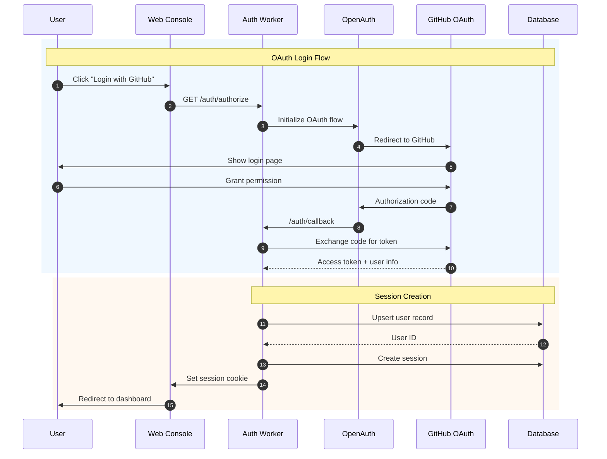

# Phase 5: Authentication

> **Phase**: 5 of 7
> **Priority**: Medium
> **Estimated Duration**: 2 days
> **Dependencies**: Phase 4 (Database Layer)

---

## Objective

OpenAuth를 사용하여 GitHub OAuth 인증 시스템을 구축합니다. 기존 Claude/Codex/Gemini API 키 인증도 통합합니다.

---

## Target Architecture



---

## Package Structure

```
packages/auth/
├── src/
│   ├── index.ts                # Main exports
│   ├── openauth.ts             # OpenAuth configuration
│   ├── github.ts               # GitHub provider
│   ├── session.ts              # Session management
│   ├── middleware.ts           # Auth middleware
│   ├── routes/
│   │   ├── authorize.ts        # /auth/authorize
│   │   ├── callback.ts         # /auth/callback
│   │   ├── logout.ts           # /auth/logout
│   │   └── status.ts           # /auth/status
│   └── types.ts                # Type definitions
├── package.json
└── tsconfig.json
```

---

## Implementation Steps

### Step 5.1: Package Setup

**File: `packages/auth/package.json`**
```json
{
  "name": "@supercoin/auth",
  "version": "0.1.0",
  "type": "module",
  "main": "./src/index.ts",
  "types": "./src/index.ts",
  "exports": {
    ".": "./src/index.ts",
    "./middleware": "./src/middleware.ts",
    "./session": "./src/session.ts"
  },
  "dependencies": {
    "@openauthjs/openauth": "^0.4.3",
    "@supercoin/database": "workspace:*",
    "@supercoin/shared": "workspace:*",
    "hono": "^4.0.0",
    "jose": "^5.10.0"
  },
  "devDependencies": {
    "@supercoin/tsconfig": "workspace:*",
    "typescript": "^5.3.3"
  }
}
```

### Step 5.2: Type Definitions

**File: `packages/auth/src/types.ts`**
```typescript
export interface AuthSession {
  id: string;
  userId: string;
  email: string;
  expiresAt: number;
}

export interface GitHubUser {
  id: number;
  login: string;
  name: string;
  email: string;
  avatar_url: string;
}

export interface AuthConfig {
  githubClientId: string;
  githubClientSecret: string;
  jwtSecret: string;
  cookieName?: string;
  cookieDomain?: string;
  secureCookie?: boolean;
}

export interface AuthContext {
  session: AuthSession | null;
  isAuthenticated: boolean;
}
```

### Step 5.3: OpenAuth Configuration

**File: `packages/auth/src/openauth.ts`**
```typescript
import { createClient } from "@openauthjs/openauth/client";
import { subjects } from "@openauthjs/openauth/subject";
import type { AuthConfig } from "./types";

export function createAuthClient(config: AuthConfig) {
  return createClient({
    clientID: config.githubClientId,
    issuer: process.env.AUTH_ISSUER ?? "http://localhost:3100",
  });
}

export const authSubjects = subjects({
  user: {
    type: "object",
    properties: {
      id: { type: "string" },
      email: { type: "string" },
      name: { type: "string" },
      avatarUrl: { type: "string" },
      githubId: { type: "string" },
    },
    required: ["id", "email", "name", "githubId"],
  },
});

export type AuthSubjects = typeof authSubjects;
```

### Step 5.4: GitHub Provider

**File: `packages/auth/src/github.ts`**
```typescript
import { GithubAdapter } from "@openauthjs/openauth/adapter/github";
import type { GitHubUser, AuthConfig } from "./types";

export function createGitHubProvider(config: AuthConfig) {
  return GithubAdapter({
    clientID: config.githubClientId,
    clientSecret: config.githubClientSecret,
    scopes: ["read:user", "user:email"],
  });
}

export async function fetchGitHubUser(accessToken: string): Promise<GitHubUser> {
  const response = await fetch("https://api.github.com/user", {
    headers: {
      Authorization: `Bearer ${accessToken}`,
      Accept: "application/vnd.github.v3+json",
    },
  });

  if (!response.ok) {
    throw new Error(`GitHub API error: ${response.status}`);
  }

  const user = await response.json();

  // Fetch primary email if not public
  if (!user.email) {
    const emailsResponse = await fetch("https://api.github.com/user/emails", {
      headers: {
        Authorization: `Bearer ${accessToken}`,
        Accept: "application/vnd.github.v3+json",
      },
    });

    if (emailsResponse.ok) {
      const emails = await emailsResponse.json();
      const primary = emails.find((e: any) => e.primary && e.verified);
      if (primary) {
        user.email = primary.email;
      }
    }
  }

  return user;
}
```

### Step 5.5: Session Management

**File: `packages/auth/src/session.ts`**
```typescript
import { SignJWT, jwtVerify } from "jose";
import type { AuthSession, AuthConfig } from "./types";

const encoder = new TextEncoder();

export class SessionManager {
  private secret: Uint8Array;
  private cookieName: string;
  private secureCookie: boolean;
  private cookieDomain?: string;

  constructor(config: AuthConfig) {
    this.secret = encoder.encode(config.jwtSecret);
    this.cookieName = config.cookieName ?? "supercoin_session";
    this.secureCookie = config.secureCookie ?? true;
    this.cookieDomain = config.cookieDomain;
  }

  async createSession(data: Omit<AuthSession, "expiresAt">): Promise<string> {
    const expiresAt = Date.now() + 7 * 24 * 60 * 60 * 1000; // 7 days

    const token = await new SignJWT({ ...data, expiresAt })
      .setProtectedHeader({ alg: "HS256" })
      .setIssuedAt()
      .setExpirationTime("7d")
      .sign(this.secret);

    return token;
  }

  async verifySession(token: string): Promise<AuthSession | null> {
    try {
      const { payload } = await jwtVerify(token, this.secret);
      const session = payload as unknown as AuthSession;

      if (session.expiresAt < Date.now()) {
        return null;
      }

      return session;
    } catch {
      return null;
    }
  }

  createCookieHeader(token: string): string {
    const parts = [
      `${this.cookieName}=${token}`,
      "HttpOnly",
      "SameSite=Lax",
      "Path=/",
      "Max-Age=604800", // 7 days
    ];

    if (this.secureCookie) {
      parts.push("Secure");
    }

    if (this.cookieDomain) {
      parts.push(`Domain=${this.cookieDomain}`);
    }

    return parts.join("; ");
  }

  createLogoutCookieHeader(): string {
    return [
      `${this.cookieName}=`,
      "HttpOnly",
      "SameSite=Lax",
      "Path=/",
      "Max-Age=0",
    ].join("; ");
  }

  extractTokenFromCookie(cookieHeader: string | null): string | null {
    if (!cookieHeader) return null;

    const cookies = cookieHeader.split(";").map((c) => c.trim());
    const sessionCookie = cookies.find((c) => c.startsWith(`${this.cookieName}=`));

    if (!sessionCookie) return null;

    return sessionCookie.split("=")[1];
  }
}
```

### Step 5.6: Auth Middleware

**File: `packages/auth/src/middleware.ts`**
```typescript
import { createMiddleware } from "hono/factory";
import type { Context, Next } from "hono";
import { SessionManager } from "./session";
import type { AuthConfig, AuthContext, AuthSession } from "./types";

export function createAuthMiddleware(config: AuthConfig) {
  const sessionManager = new SessionManager(config);

  return createMiddleware<{
    Variables: {
      auth: AuthContext;
      session: AuthSession | null;
    };
  }>(async (c, next) => {
    const cookieHeader = c.req.header("Cookie");
    const token = sessionManager.extractTokenFromCookie(cookieHeader);

    let session: AuthSession | null = null;

    if (token) {
      session = await sessionManager.verifySession(token);
    }

    c.set("auth", {
      session,
      isAuthenticated: session !== null,
    });
    c.set("session", session);

    await next();
  });
}

export function requireAuth() {
  return createMiddleware(async (c, next) => {
    const auth = c.get("auth");

    if (!auth?.isAuthenticated) {
      return c.json({ error: "Unauthorized" }, 401);
    }

    await next();
  });
}
```

### Step 5.7: Auth Routes

**File: `packages/auth/src/routes/authorize.ts`**
```typescript
import { Hono } from "hono";
import { createGitHubProvider } from "../github";
import type { AuthConfig } from "../types";

export function createAuthorizeRoute(config: AuthConfig) {
  const app = new Hono();
  const github = createGitHubProvider(config);

  app.get("/authorize", async (c) => {
    const redirectUri = `${process.env.AUTH_BASE_URL}/auth/callback`;
    const state = crypto.randomUUID();

    // Store state in cookie for CSRF protection
    c.header(
      "Set-Cookie",
      `auth_state=${state}; HttpOnly; SameSite=Lax; Path=/; Max-Age=600`
    );

    const authUrl = new URL("https://github.com/login/oauth/authorize");
    authUrl.searchParams.set("client_id", config.githubClientId);
    authUrl.searchParams.set("redirect_uri", redirectUri);
    authUrl.searchParams.set("scope", "read:user user:email");
    authUrl.searchParams.set("state", state);

    return c.redirect(authUrl.toString());
  });

  return app;
}
```

**File: `packages/auth/src/routes/callback.ts`**
```typescript
import { Hono } from "hono";
import { fetchGitHubUser } from "../github";
import { SessionManager } from "../session";
import { userService } from "@supercoin/console-core/services/user";
import type { AuthConfig } from "../types";

export function createCallbackRoute(config: AuthConfig) {
  const app = new Hono();
  const sessionManager = new SessionManager(config);

  app.get("/callback", async (c) => {
    const code = c.req.query("code");
    const state = c.req.query("state");
    const error = c.req.query("error");

    if (error) {
      return c.redirect(`/auth/error?message=${encodeURIComponent(error)}`);
    }

    if (!code || !state) {
      return c.redirect("/auth/error?message=missing_params");
    }

    // Verify state
    const cookieHeader = c.req.header("Cookie");
    const storedState = cookieHeader
      ?.split(";")
      .find((c) => c.trim().startsWith("auth_state="))
      ?.split("=")[1];

    if (state !== storedState) {
      return c.redirect("/auth/error?message=invalid_state");
    }

    try {
      // Exchange code for token
      const tokenResponse = await fetch(
        "https://github.com/login/oauth/access_token",
        {
          method: "POST",
          headers: {
            Accept: "application/json",
            "Content-Type": "application/json",
          },
          body: JSON.stringify({
            client_id: config.githubClientId,
            client_secret: config.githubClientSecret,
            code,
          }),
        }
      );

      const tokenData = await tokenResponse.json();

      if (tokenData.error) {
        throw new Error(tokenData.error_description || tokenData.error);
      }

      // Fetch user info
      const githubUser = await fetchGitHubUser(tokenData.access_token);

      // Upsert user in database
      const user = await userService.upsertFromGithub({
        email: githubUser.email,
        name: githubUser.name || githubUser.login,
        avatarUrl: githubUser.avatar_url,
        githubId: String(githubUser.id),
      });

      // Create session
      const sessionToken = await sessionManager.createSession({
        id: crypto.randomUUID(),
        userId: user.id,
        email: user.email,
      });

      // Set session cookie and redirect
      c.header("Set-Cookie", sessionManager.createCookieHeader(sessionToken));
      c.header(
        "Set-Cookie",
        "auth_state=; HttpOnly; SameSite=Lax; Path=/; Max-Age=0"
      );

      return c.redirect("/");
    } catch (error) {
      console.error("OAuth callback error:", error);
      return c.redirect("/auth/error?message=auth_failed");
    }
  });

  return app;
}
```

**File: `packages/auth/src/routes/logout.ts`**
```typescript
import { Hono } from "hono";
import { SessionManager } from "../session";
import type { AuthConfig } from "../types";

export function createLogoutRoute(config: AuthConfig) {
  const app = new Hono();
  const sessionManager = new SessionManager(config);

  app.post("/logout", async (c) => {
    c.header("Set-Cookie", sessionManager.createLogoutCookieHeader());
    return c.json({ success: true });
  });

  app.get("/logout", async (c) => {
    c.header("Set-Cookie", sessionManager.createLogoutCookieHeader());
    return c.redirect("/");
  });

  return app;
}
```

**File: `packages/auth/src/routes/status.ts`**
```typescript
import { Hono } from "hono";

export function createStatusRoute() {
  const app = new Hono();

  app.get("/status", async (c) => {
    const auth = c.get("auth");

    if (!auth?.isAuthenticated) {
      return c.json({
        authenticated: false,
        user: null,
      });
    }

    return c.json({
      authenticated: true,
      user: {
        id: auth.session?.userId,
        email: auth.session?.email,
      },
    });
  });

  return app;
}
```

### Step 5.8: Main Export

**File: `packages/auth/src/index.ts`**
```typescript
import { Hono } from "hono";
import { createAuthMiddleware, requireAuth } from "./middleware";
import { createAuthorizeRoute } from "./routes/authorize";
import { createCallbackRoute } from "./routes/callback";
import { createLogoutRoute } from "./routes/logout";
import { createStatusRoute } from "./routes/status";
import type { AuthConfig } from "./types";

export function createAuthRouter(config: AuthConfig) {
  const app = new Hono();

  // Apply auth middleware to all routes
  app.use("*", createAuthMiddleware(config));

  // Mount routes
  app.route("/", createAuthorizeRoute(config));
  app.route("/", createCallbackRoute(config));
  app.route("/", createLogoutRoute(config));
  app.route("/", createStatusRoute());

  return app;
}

export { createAuthMiddleware, requireAuth } from "./middleware";
export { SessionManager } from "./session";
export type * from "./types";
```

---

## Console Integration

### Auth Context

**File: `packages/console/app/src/context/auth.tsx`**
```tsx
import { createContext, useContext, createResource, type ParentComponent } from "solid-js";

interface AuthUser {
  id: string;
  email: string;
}

interface AuthContextValue {
  user: () => AuthUser | null;
  isLoading: () => boolean;
  isAuthenticated: () => boolean;
  login: () => void;
  logout: () => Promise<void>;
}

const AuthContext = createContext<AuthContextValue>();

async function fetchAuthStatus(): Promise<{ authenticated: boolean; user: AuthUser | null }> {
  const response = await fetch("/auth/status");
  return response.json();
}

export const AuthProvider: ParentComponent = (props) => {
  const [authData, { refetch }] = createResource(fetchAuthStatus);

  const login = () => {
    window.location.href = "/auth/authorize";
  };

  const logout = async () => {
    await fetch("/auth/logout", { method: "POST" });
    await refetch();
  };

  const value: AuthContextValue = {
    user: () => authData()?.user ?? null,
    isLoading: () => authData.loading,
    isAuthenticated: () => authData()?.authenticated ?? false,
    login,
    logout,
  };

  return <AuthContext.Provider value={value}>{props.children}</AuthContext.Provider>;
};

export function useAuth() {
  const context = useContext(AuthContext);
  if (!context) {
    throw new Error("useAuth must be used within AuthProvider");
  }
  return context;
}
```

---

## Environment Variables

```bash
# .env
AUTH_BASE_URL=http://localhost:3000
AUTH_ISSUER=http://localhost:3100
GITHUB_CLIENT_ID=your_client_id
GITHUB_CLIENT_SECRET=your_client_secret
JWT_SECRET=your_jwt_secret_min_32_chars
```

---

## Verification Commands

```bash
# 1. Install dependencies
bun install

# 2. Set environment variables
cp .env.example .env
# Edit .env with your GitHub OAuth credentials

# 3. Start the server
bun turbo dev

# 4. Test OAuth flow
open http://localhost:3000/auth/authorize

# 5. Check auth status
curl http://localhost:3000/auth/status
```

---

## Success Criteria

- [ ] GitHub OAuth flow completes successfully
- [ ] User is created/updated in database after login
- [ ] Session cookie is set correctly
- [ ] Auth middleware validates session
- [ ] Protected routes require authentication
- [ ] Logout clears session
- [ ] Auth status endpoint returns correct data

---

**Previous**: [Phase 4: Database Layer](./04-phase4-database.md)
**Next**: [Phase 6: Infrastructure](./06-phase6-infrastructure.md)
