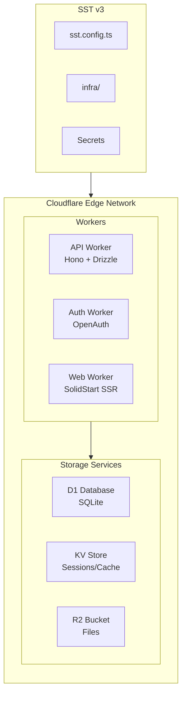

# Phase 6: Infrastructure

> **Phase**: 6 of 7
> **Priority**: Medium
> **Estimated Duration**: 2 days
> **Dependencies**: Phase 5 (Authentication)

---

## Objective

SST v3를 사용하여 Cloudflare Workers 기반 인프라를 구축합니다. Workers, D1, KV, R2를 통합합니다.

---

## Target Architecture



---

## Project Structure

```
supercoin/
├── infra/
│   ├── api.ts              # API worker configuration
│   ├── auth.ts             # Auth worker configuration
│   ├── console.ts          # Web console (SSR)
│   ├── storage.ts          # D1, KV, R2 resources
│   └── secrets.ts          # Secret management
├── sst.config.ts           # Main SST configuration
└── .env                    # Environment variables
```

---

## Implementation Steps

### Step 6.1: SST Configuration

**File: `sst.config.ts`**
```typescript
/// <reference path="./.sst/platform/config.d.ts" />

export default $config({
  app(input) {
    return {
      name: "supercoin",
      removal: input?.stage === "production" ? "retain" : "remove",
      protect: ["production"].includes(input?.stage),
      home: "cloudflare",
    };
  },
  async run() {
    // Import infrastructure modules
    const storage = await import("./infra/storage");
    const api = await import("./infra/api");
    const auth = await import("./infra/auth");
    const console = await import("./infra/console");

    return {
      api: api.apiUrl,
      auth: auth.authUrl,
      console: console.consoleUrl,
    };
  },
});
```

### Step 6.2: Storage Resources

**File: `infra/storage.ts`**
```typescript
// D1 Database
export const database = new sst.cloudflare.D1("Database");

// KV Store for sessions and cache
export const sessionStore = new sst.cloudflare.Kv("SessionStore");

// KV Store for rate limiting
export const rateLimitStore = new sst.cloudflare.Kv("RateLimitStore");

// R2 Bucket for file uploads
export const fileBucket = new sst.cloudflare.Bucket("FileBucket");

// R2 Bucket for logs
export const logBucket = new sst.cloudflare.Bucket("LogBucket");
```

### Step 6.3: Secrets Management

**File: `infra/secrets.ts`**
```typescript
// GitHub OAuth credentials
export const githubClientId = new sst.Secret("GithubClientId");
export const githubClientSecret = new sst.Secret("GithubClientSecret");

// JWT secret for session signing
export const jwtSecret = new sst.Secret("JwtSecret");

// API keys for AI providers
export const anthropicApiKey = new sst.Secret("AnthropicApiKey");
export const openaiApiKey = new sst.Secret("OpenaiApiKey");
export const googleApiKey = new sst.Secret("GoogleApiKey");

// All secrets grouped for easy linking
export const allSecrets = [
  githubClientId,
  githubClientSecret,
  jwtSecret,
  anthropicApiKey,
  openaiApiKey,
  googleApiKey,
];
```

### Step 6.4: API Worker

**File: `infra/api.ts`**
```typescript
import { database, sessionStore } from "./storage";
import { allSecrets, jwtSecret } from "./secrets";

export const apiWorker = new sst.cloudflare.Worker("ApiWorker", {
  handler: "./packages/server/src/index.ts",
  link: [database, sessionStore, jwtSecret, ...allSecrets],
  url: true,
  environment: {
    NODE_ENV: $app.stage === "production" ? "production" : "development",
  },
});

export const apiUrl = apiWorker.url;
```

### Step 6.5: Auth Worker

**File: `infra/auth.ts`**
```typescript
import { database, sessionStore } from "./storage";
import { githubClientId, githubClientSecret, jwtSecret } from "./secrets";

export const authWorker = new sst.cloudflare.Worker("AuthWorker", {
  handler: "./packages/auth/src/worker.ts",
  link: [database, sessionStore, githubClientId, githubClientSecret, jwtSecret],
  url: true,
  environment: {
    NODE_ENV: $app.stage === "production" ? "production" : "development",
  },
});

export const authUrl = authWorker.url;
```

### Step 6.6: Console Worker (SSR)

**File: `infra/console.ts`**
```typescript
import { database, sessionStore, fileBucket } from "./storage";
import { allSecrets } from "./secrets";
import { apiWorker } from "./api";
import { authWorker } from "./auth";

export const consoleWorker = new sst.cloudflare.Worker("ConsoleWorker", {
  handler: "./packages/console/app/.output/server/index.mjs",
  link: [database, sessionStore, fileBucket, apiWorker, authWorker, ...allSecrets],
  url: true,
  assets: {
    path: "./packages/console/app/.output/public",
  },
  environment: {
    NODE_ENV: $app.stage === "production" ? "production" : "development",
    API_URL: apiWorker.url,
    AUTH_URL: authWorker.url,
  },
});

export const consoleUrl = consoleWorker.url;
```

### Step 6.7: Worker Handler (API)

**File: `packages/server/src/index.ts`**
```typescript
import { Hono } from "hono";
import { cors } from "hono/cors";
import { drizzle } from "drizzle-orm/d1";
import { Resource } from "sst";
import * as schema from "@supercoin/database/schema";

type Bindings = {
  Database: D1Database;
  SessionStore: KVNamespace;
};

const app = new Hono<{ Bindings: Bindings }>();

// CORS middleware
app.use("*", cors({
  origin: ["http://localhost:3000", "https://supercoin.ai"],
  credentials: true,
}));

// Health check
app.get("/health", (c) => {
  return c.json({
    status: "ok",
    timestamp: new Date().toISOString(),
    stage: process.env.NODE_ENV,
  });
});

// Database connection helper
app.use("*", async (c, next) => {
  const db = drizzle(c.env.Database, { schema });
  c.set("db", db);
  await next();
});

// API routes
app.get("/api/users", async (c) => {
  const db = c.get("db");
  const users = await db.query.users.findMany({
    limit: 10,
  });
  return c.json(users);
});

app.get("/api/sessions", async (c) => {
  const db = c.get("db");
  const sessions = await db.query.sessions.findMany({
    limit: 10,
    orderBy: (sessions, { desc }) => [desc(sessions.createdAt)],
  });
  return c.json(sessions);
});

// Models endpoint
app.get("/api/models", (c) => {
  return c.json({
    providers: [
      {
        id: "anthropic",
        name: "Anthropic",
        models: ["claude-sonnet-4", "claude-3.5-sonnet", "claude-3.5-haiku"],
      },
      {
        id: "openai",
        name: "OpenAI",
        models: ["gpt-4o", "gpt-4o-mini", "o1", "o1-mini"],
      },
      {
        id: "google",
        name: "Google",
        models: ["gemini-2.0-flash", "gemini-1.5-pro", "gemini-1.5-flash"],
      },
    ],
  });
});

export default app;
```

### Step 6.8: Worker Handler (Auth)

**File: `packages/auth/src/worker.ts`**
```typescript
import { Hono } from "hono";
import { Resource } from "sst";
import { createAuthRouter } from "./index";

type Bindings = {
  Database: D1Database;
  SessionStore: KVNamespace;
};

const app = new Hono<{ Bindings: Bindings }>();

// Mount auth routes
app.route(
  "/auth",
  createAuthRouter({
    githubClientId: Resource.GithubClientId.value,
    githubClientSecret: Resource.GithubClientSecret.value,
    jwtSecret: Resource.JwtSecret.value,
    secureCookie: process.env.NODE_ENV === "production",
  })
);

export default app;
```

### Step 6.9: SolidStart Cloudflare Preset

**File: `packages/console/app/app.config.ts`**
```typescript
import { defineConfig } from "@solidjs/start/config";

export default defineConfig({
  server: {
    preset: "cloudflare-pages",
    rollupConfig: {
      external: ["node:async_hooks"],
    },
  },
  vite: {
    ssr: {
      noExternal: ["@kobalte/core", "@supercoin/ui"],
    },
  },
});
```

---

## Deployment Commands

### Development

```bash
# Install SST
bun add -D sst

# Set secrets (one-time)
bunx sst secret set GithubClientId your_client_id
bunx sst secret set GithubClientSecret your_client_secret
bunx sst secret set JwtSecret your_jwt_secret_min_32_chars
bunx sst secret set AnthropicApiKey sk-ant-...
bunx sst secret set OpenaiApiKey sk-...
bunx sst secret set GoogleApiKey AIza...

# Start local development
bunx sst dev
```

### Staging

```bash
# Deploy to staging
bunx sst deploy --stage staging

# Check deployment
bunx sst status --stage staging
```

### Production

```bash
# Deploy to production
bunx sst deploy --stage production

# Check logs
bunx sst logs --stage production
```

---

## Wrangler Configuration

**File: `wrangler.toml`** (for local development without SST)
```toml
name = "supercoin-api"
main = "packages/server/src/index.ts"
compatibility_date = "2024-01-01"

[[d1_databases]]
binding = "Database"
database_name = "supercoin"
database_id = "local"

[[kv_namespaces]]
binding = "SessionStore"
id = "local"

[[r2_buckets]]
binding = "FileBucket"
bucket_name = "supercoin-files"
```

---

## Drizzle D1 Configuration

**File: `packages/database/drizzle.config.ts`** (updated for D1)
```typescript
import { defineConfig } from "drizzle-kit";

export default defineConfig({
  schema: "./src/schema/index.ts",
  out: "./src/migrations",
  dialect: "sqlite",
  driver: "d1-http",
  dbCredentials: {
    accountId: process.env.CLOUDFLARE_ACCOUNT_ID!,
    databaseId: process.env.CLOUDFLARE_D1_DATABASE_ID!,
    token: process.env.CLOUDFLARE_API_TOKEN!,
  },
});
```

---

## Environment Variables

```bash
# Cloudflare credentials
CLOUDFLARE_API_TOKEN=your_api_token
CLOUDFLARE_ACCOUNT_ID=your_account_id
CLOUDFLARE_D1_DATABASE_ID=your_d1_id

# SST stage
SST_STAGE=dev
```

---

## Verification Commands

```bash
# 1. Initialize SST
bunx sst init

# 2. Set all secrets
bunx sst secret set GithubClientId $GITHUB_CLIENT_ID
# ... (repeat for all secrets)

# 3. Start local dev (with Cloudflare simulation)
bunx sst dev

# 4. Test API endpoint
curl http://localhost:3000/health

# 5. Deploy to staging
bunx sst deploy --stage staging

# 6. Check outputs
bunx sst status --stage staging
```

---

## Success Criteria

- [ ] SST initializes correctly with Cloudflare provider
- [ ] All secrets are set via `sst secret set`
- [ ] `sst dev` starts local simulation
- [ ] D1 database connects and queries work
- [ ] KV store for sessions works
- [ ] `sst deploy --stage staging` succeeds
- [ ] All workers have public URLs
- [ ] Console SSR works on Cloudflare

---

**Previous**: [Phase 5: Authentication](./05-phase5-authentication.md)
**Next**: [Phase 7: Desktop App](./07-phase7-desktop.md)
