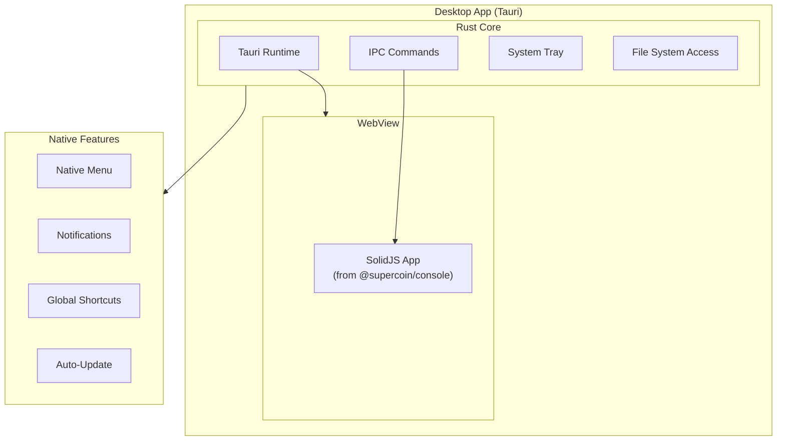

# Phase 7: Desktop App

> **Phase**: 7 of 7
> **Priority**: Low
> **Estimated Duration**: 2 days
> **Dependencies**: Phase 3 (Web Console)

---

## Objective

Tauri 2.x를 사용하여 크로스 플랫폼 데스크톱 애플리케이션을 생성합니다. 웹 콘솔을 래핑하고 네이티브 기능을 추가합니다.

---

## Target Architecture



---

## Package Structure

```
packages/desktop/
├── src/
│   ├── lib.rs              # Tauri main entry
│   ├── commands/
│   │   ├── mod.rs          # Command exports
│   │   ├── config.rs       # Config commands
│   │   └── auth.rs         # Auth commands
│   └── tray.rs             # System tray
├── src-tauri/
│   ├── Cargo.toml          # Rust dependencies
│   ├── tauri.conf.json     # Tauri configuration
│   ├── capabilities/
│   │   └── default.json    # Permission capabilities
│   └── icons/              # App icons
├── src/                    # Frontend (optional overrides)
│   └── main.ts
├── package.json
└── tsconfig.json
```

---

## Implementation Steps

### Step 7.1: Package Setup

**File: `packages/desktop/package.json`**
```json
{
  "name": "@supercoin/desktop",
  "version": "0.1.0",
  "type": "module",
  "scripts": {
    "dev": "tauri dev",
    "build": "tauri build",
    "build:debug": "tauri build --debug"
  },
  "dependencies": {
    "@supercoin/ui": "workspace:*",
    "solid-js": "^1.9.10"
  },
  "devDependencies": {
    "@tauri-apps/cli": "^2.5.0",
    "@tauri-apps/api": "^2.5.0",
    "@supercoin/tsconfig": "workspace:*",
    "typescript": "^5.3.3",
    "vite": "^7.1.4",
    "vite-plugin-solid": "^2.11.6"
  }
}
```

### Step 7.2: Tauri Configuration

**File: `packages/desktop/src-tauri/tauri.conf.json`**
```json
{
  "$schema": "https://schema.tauri.app/config/2",
  "productName": "SuperCoin",
  "version": "0.1.0",
  "identifier": "ai.supercoin.desktop",
  "build": {
    "beforeBuildCommand": "cd ../console/app && bun run build",
    "beforeDevCommand": "cd ../console/app && bun run dev",
    "devUrl": "http://localhost:3000",
    "frontendDist": "../console/app/.output/public"
  },
  "app": {
    "withGlobalTauri": true,
    "windows": [
      {
        "title": "SuperCoin",
        "width": 1200,
        "height": 800,
        "minWidth": 800,
        "minHeight": 600,
        "resizable": true,
        "fullscreen": false,
        "decorations": true,
        "transparent": false,
        "center": true
      }
    ],
    "security": {
      "csp": null
    },
    "trayIcon": {
      "iconPath": "icons/icon.png",
      "iconAsTemplate": true
    }
  },
  "bundle": {
    "active": true,
    "targets": "all",
    "icon": [
      "icons/32x32.png",
      "icons/128x128.png",
      "icons/128x128@2x.png",
      "icons/icon.icns",
      "icons/icon.ico"
    ],
    "macOS": {
      "minimumSystemVersion": "10.15",
      "frameworks": [],
      "license": "../LICENSE"
    },
    "windows": {
      "wix": {
        "language": "en-US"
      }
    },
    "linux": {
      "deb": {
        "depends": []
      }
    }
  }
}
```

### Step 7.3: Cargo Configuration

**File: `packages/desktop/src-tauri/Cargo.toml`**
```toml
[package]
name = "supercoin-desktop"
version = "0.1.0"
edition = "2021"
rust-version = "1.70"

[build-dependencies]
tauri-build = { version = "2", features = [] }

[dependencies]
tauri = { version = "2", features = ["tray-icon", "protocol-asset"] }
tauri-plugin-shell = "2"
tauri-plugin-notification = "2"
tauri-plugin-dialog = "2"
tauri-plugin-fs = "2"
tauri-plugin-store = "2"
tauri-plugin-updater = "2"
tauri-plugin-global-shortcut = "2"
serde = { version = "1", features = ["derive"] }
serde_json = "1"
tokio = { version = "1", features = ["full"] }

[features]
default = ["custom-protocol"]
custom-protocol = ["tauri/custom-protocol"]

[profile.release]
panic = "abort"
codegen-units = 1
lto = true
opt-level = "s"
strip = true
```

### Step 7.4: Rust Main Entry

**File: `packages/desktop/src-tauri/src/lib.rs`**
```rust
mod commands;
mod tray;

use tauri::Manager;
use tauri_plugin_global_shortcut::{Code, Modifiers, ShortcutState};

#[cfg_attr(mobile, tauri::mobile_entry_point)]
pub fn run() {
    tauri::Builder::default()
        .plugin(tauri_plugin_shell::init())
        .plugin(tauri_plugin_notification::init())
        .plugin(tauri_plugin_dialog::init())
        .plugin(tauri_plugin_fs::init())
        .plugin(tauri_plugin_store::Builder::default().build())
        .plugin(tauri_plugin_updater::Builder::default().build())
        .plugin(
            tauri_plugin_global_shortcut::Builder::new()
                .with_shortcuts(["ctrl+shift+s", "cmd+shift+s"])?
                .with_handler(|app, shortcut, event| {
                    if event.state == ShortcutState::Pressed {
                        if let Some(window) = app.get_webview_window("main") {
                            let _ = window.show();
                            let _ = window.set_focus();
                        }
                    }
                })
                .build(),
        )
        .invoke_handler(tauri::generate_handler![
            commands::get_config,
            commands::set_config,
            commands::get_auth_status,
            commands::open_external,
        ])
        .setup(|app| {
            // Set up system tray
            tray::create_tray(app)?;
            Ok(())
        })
        .run(tauri::generate_context!())
        .expect("error while running tauri application");
}
```

### Step 7.5: IPC Commands

**File: `packages/desktop/src-tauri/src/commands/mod.rs`**
```rust
mod config;
mod auth;

pub use config::*;
pub use auth::*;

use tauri::command;

#[command]
pub async fn open_external(url: String) -> Result<(), String> {
    open::that(url).map_err(|e| e.to_string())
}
```

**File: `packages/desktop/src-tauri/src/commands/config.rs`**
```rust
use serde::{Deserialize, Serialize};
use tauri::command;
use tauri_plugin_store::StoreExt;

#[derive(Debug, Serialize, Deserialize)]
pub struct AppConfig {
    pub default_model: String,
    pub theme: String,
    pub auto_update: bool,
}

impl Default for AppConfig {
    fn default() -> Self {
        Self {
            default_model: "anthropic/claude-sonnet-4".to_string(),
            theme: "system".to_string(),
            auto_update: true,
        }
    }
}

#[command]
pub async fn get_config(app: tauri::AppHandle) -> Result<AppConfig, String> {
    let store = app.store("config.json").map_err(|e| e.to_string())?;
    
    let config = AppConfig {
        default_model: store
            .get("default_model")
            .and_then(|v| v.as_str().map(String::from))
            .unwrap_or_else(|| "anthropic/claude-sonnet-4".to_string()),
        theme: store
            .get("theme")
            .and_then(|v| v.as_str().map(String::from))
            .unwrap_or_else(|| "system".to_string()),
        auto_update: store
            .get("auto_update")
            .and_then(|v| v.as_bool())
            .unwrap_or(true),
    };
    
    Ok(config)
}

#[command]
pub async fn set_config(app: tauri::AppHandle, config: AppConfig) -> Result<(), String> {
    let store = app.store("config.json").map_err(|e| e.to_string())?;
    
    store.set("default_model", config.default_model);
    store.set("theme", config.theme);
    store.set("auto_update", config.auto_update);
    store.save().map_err(|e| e.to_string())?;
    
    Ok(())
}
```

**File: `packages/desktop/src-tauri/src/commands/auth.rs`**
```rust
use serde::{Deserialize, Serialize};
use tauri::command;
use tauri_plugin_store::StoreExt;

#[derive(Debug, Serialize, Deserialize)]
pub struct AuthStatus {
    pub is_authenticated: bool,
    pub user_email: Option<String>,
}

#[command]
pub async fn get_auth_status(app: tauri::AppHandle) -> Result<AuthStatus, String> {
    let store = app.store("auth.json").map_err(|e| e.to_string())?;
    
    let status = AuthStatus {
        is_authenticated: store
            .get("is_authenticated")
            .and_then(|v| v.as_bool())
            .unwrap_or(false),
        user_email: store
            .get("user_email")
            .and_then(|v| v.as_str().map(String::from)),
    };
    
    Ok(status)
}
```

### Step 7.6: System Tray

**File: `packages/desktop/src-tauri/src/tray.rs`**
```rust
use tauri::{
    menu::{Menu, MenuItem},
    tray::{MouseButton, MouseButtonState, TrayIconBuilder, TrayIconEvent},
    Manager, Runtime,
};

pub fn create_tray<R: Runtime>(app: &tauri::App<R>) -> tauri::Result<()> {
    let show_item = MenuItem::with_id(app, "show", "Show SuperCoin", true, None::<&str>)?;
    let quit_item = MenuItem::with_id(app, "quit", "Quit", true, None::<&str>)?;
    
    let menu = Menu::with_items(app, &[&show_item, &quit_item])?;
    
    let _tray = TrayIconBuilder::new()
        .menu(&menu)
        .tooltip("SuperCoin")
        .icon(app.default_window_icon().unwrap().clone())
        .on_menu_event(|app, event| match event.id.as_ref() {
            "show" => {
                if let Some(window) = app.get_webview_window("main") {
                    let _ = window.show();
                    let _ = window.set_focus();
                }
            }
            "quit" => {
                app.exit(0);
            }
            _ => {}
        })
        .on_tray_icon_event(|tray, event| {
            if let TrayIconEvent::Click {
                button: MouseButton::Left,
                button_state: MouseButtonState::Up,
                ..
            } = event
            {
                let app = tray.app_handle();
                if let Some(window) = app.get_webview_window("main") {
                    let _ = window.show();
                    let _ = window.set_focus();
                }
            }
        })
        .build(app)?;
    
    Ok(())
}
```

### Step 7.7: Capabilities

**File: `packages/desktop/src-tauri/capabilities/default.json`**
```json
{
  "$schema": "https://schema.tauri.app/config/2/capability",
  "identifier": "default",
  "description": "Default capabilities for SuperCoin desktop",
  "windows": ["main"],
  "permissions": [
    "core:default",
    "shell:allow-open",
    "notification:allow-show",
    "dialog:allow-open",
    "dialog:allow-save",
    "fs:allow-read-text-file",
    "fs:allow-write-text-file",
    "store:default",
    "updater:default",
    "global-shortcut:allow-register"
  ]
}
```

### Step 7.8: Frontend Integration

**File: `packages/desktop/src/main.ts`**
```typescript
import { invoke } from "@tauri-apps/api/core";
import { check } from "@tauri-apps/plugin-updater";
import { ask } from "@tauri-apps/plugin-dialog";
import { sendNotification } from "@tauri-apps/plugin-notification";

// Check for updates on startup
async function checkForUpdates() {
  try {
    const update = await check();
    if (update) {
      const shouldUpdate = await ask(
        `A new version ${update.version} is available. Would you like to update?`,
        { title: "Update Available", kind: "info" }
      );
      
      if (shouldUpdate) {
        await update.downloadAndInstall();
      }
    }
  } catch (error) {
    console.error("Update check failed:", error);
  }
}

// Get app config from Rust
export async function getConfig() {
  return invoke<{
    default_model: string;
    theme: string;
    auto_update: boolean;
  }>("get_config");
}

// Set app config
export async function setConfig(config: {
  default_model: string;
  theme: string;
  auto_update: boolean;
}) {
  return invoke("set_config", { config });
}

// Get auth status
export async function getAuthStatus() {
  return invoke<{
    is_authenticated: boolean;
    user_email: string | null;
  }>("get_auth_status");
}

// Show notification
export async function showNotification(title: string, body: string) {
  await sendNotification({ title, body });
}

// Initialize
document.addEventListener("DOMContentLoaded", async () => {
  const config = await getConfig();
  
  if (config.auto_update) {
    await checkForUpdates();
  }
});
```

---

## Build Commands

### Development

```bash
# Install Tauri CLI
bun add -D @tauri-apps/cli

# Start development
cd packages/desktop
bun run dev
```

### Production Build

```bash
# Build for current platform
cd packages/desktop
bun run build

# Build for specific platform
# macOS
bun run build -- --target universal-apple-darwin

# Windows
bun run build -- --target x86_64-pc-windows-msvc

# Linux
bun run build -- --target x86_64-unknown-linux-gnu
```

### CI/CD Build

```bash
# Install Rust
curl --proto '=https' --tlsv1.2 -sSf https://sh.rustup.rs | sh

# Install targets
rustup target add x86_64-apple-darwin
rustup target add aarch64-apple-darwin
rustup target add x86_64-pc-windows-msvc
rustup target add x86_64-unknown-linux-gnu

# Build all platforms
bun run build
```

---

## Verification Commands

```bash
# 1. Install Rust (if not installed)
curl --proto '=https' --tlsv1.2 -sSf https://sh.rustup.rs | sh

# 2. Install Tauri dependencies
cd packages/desktop
bun install

# 3. Start development
bun run dev

# 4. Build debug version
bun run build:debug

# 5. Test IPC commands
# In browser console:
await window.__TAURI__.invoke('get_config')
```

---

## Success Criteria

- [ ] Tauri app compiles without errors
- [ ] App launches and shows web console
- [ ] System tray icon appears
- [ ] IPC commands work (get_config, set_config)
- [ ] Global shortcut (Ctrl+Shift+S) works
- [ ] Notifications work
- [ ] Auto-update checks work
- [ ] Production build creates installer

---

**Previous**: [Phase 6: Infrastructure](./06-phase6-infrastructure.md)
**Next**: Implementation begins!
