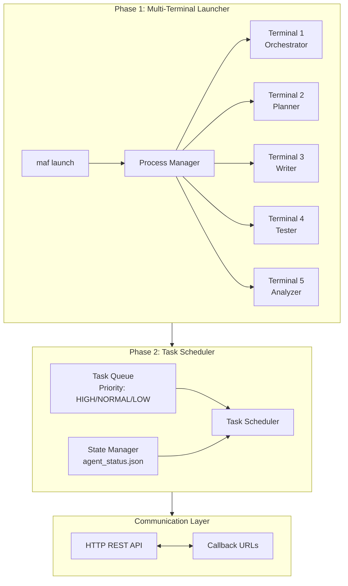
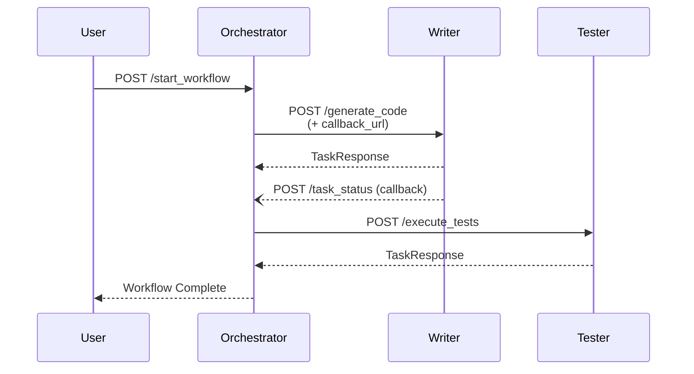

# Multi-Agent Flow v2.0

멀티 AI 에이전트 오케스트레이션 시스템 - Claude, Codex, Gemini, OpenCode를 협업시켜 소프트웨어 개발을 자동화합니다.

## Quick Start

```bash
# 설치
uv pip install -e .

# 에이전트 실행
maf launch

# 태스크 제출
maf task "REST API 생성" writer -p HIGH

# 상태 확인
maf status
```

## Architecture



## Agent Roles

| Agent | Model | Port | Responsibility |
|:------|:------|:----:|:---------------|
| **Orchestrator** | Claude | 8000 | 작업 분배, 워크플로우 조정, 코드 리뷰 |
| **Planner** | OpenCode | 8001 | 계획 수립, 아키텍처 설계 |
| **Writer** | Codex | 8002 | 코드 생성 |
| **Tester** | Codex | 8003 | 테스트 실행, 검증 |
| **Analyzer** | Gemini | 8004 | 분석, 대용량 코드 리뷰 (1M+ 토큰) |

## CLI Commands

| Command | Description |
|:--------|:------------|
| `maf launch` | 터미널 윈도우에 AI 에이전트 실행 |
| `maf status` | 모든 에이전트 상태 확인 |
| `maf stop` | 모든 에이전트 중지 |
| `maf task "desc" role [-p PRIORITY]` | 스케줄러에 태스크 제출 |
| `maf queue` | 태스크 큐 상태 확인 |
| `maf run "task"` | 전체 워크플로우 실행 (Phase 3) |
| `maf wf-status <id>` | 워크플로우 상태 확인 |
| `maf wf-list` | 모든 워크플로우 목록 |

## Communication Flow



### Communication Patterns

| Pattern | Type | Description |
|:--------|:-----|:------------|
| Request-Response | 동기 | HTTP POST → 즉시 응답 대기 |
| Callback | 비동기 | 작업 완료 후 callback_url로 상태 전송 |
| Health Check | 폴링 | GET /health 엔드포인트 |

> **Note**: 현재 WebSocket/Pub-Sub 실시간 양방향 통신은 Phase 3에서 구현 예정

## Project Status

| Phase | Status | Description |
|:------|:------:|:------------|
| Phase 1 | ✅ | Multi-Terminal Launcher |
| Phase 2 | ✅ | Task Scheduler |
| Phase 3 | ✅ | Agent Chaining, Feedback Loop |
| Phase 4 | ⏳ | WebSocket Dashboard, Real Agent Integration |

---

<details>
<summary><b>Installation Details</b></summary>

### Requirements
- Python 3.11+
- macOS or Linux
- AI CLI tools: `claude`, `codex`, `gemini`, `opencode`

### Install Methods

```bash
# Using uv (recommended)
uv pip install -e .

# Using pip
pip install -e .

# With process monitoring
pip install psutil
```

</details>

<details>
<summary><b>Configuration (config.yaml)</b></summary>

```yaml
version: "2.0"

settings:
  port_range:
    start: 8000
    end: 8010
  terminal_app: "Terminal"  # macOS: "Terminal" or "iTerm2"
  tmux_session: "supercode"  # Linux

agents:
  orchestrator:
    name: "Orchestrator"
    model: "claude"
    command: "claude"
    port: 8000
    roles: [orchestrator, reviewer]
    env:
      SUPERCODE_MODE: "orchestrator"

  planner:
    name: "Planner"
    model: "opencode"
    command: "opencode"
    port: 8001
    roles: [planner]

  writer:
    name: "Writer"
    model: "codex"
    command: "codex"
    port: 8002
    roles: [writer]

  tester:
    name: "Tester"
    model: "codex"
    command: "codex"
    port: 8003
    roles: [tester]

  analyzer:
    name: "Analyzer"
    model: "gemini"
    command: "gemini"
    port: 8004
    roles: [analyzer]
```

</details>

<details>
<summary><b>Platform Support</b></summary>

### macOS
- **Terminal.app** (default): AppleScript 기반 윈도우 관리
- **iTerm2**: 고급 윈도우 관리 (한글 로케일 이슈로 Terminal 권장)

### Linux
- **tmux**: 세션 기반 터미널 관리
  ```bash
  tmux attach -t supercode  # 에이전트 확인
  ```

</details>

<details>
<summary><b>API Reference</b></summary>

### Start Workflow
```bash
curl -X POST http://localhost:8000/api/orchestrator/start_workflow \
  -H "Content-Type: application/json" \
  -d '{"workflow_type": "code_generation", "details": {"task_description": "Create a fibonacci function"}}'
```

### Check Workflow Status
```bash
curl http://localhost:8000/api/orchestrator/workflow_status/{task_id}
```

### Health Check
```bash
curl http://localhost:8000/health
```

</details>

<details>
<summary><b>Programmatic Usage</b></summary>

### Launcher
```python
from multi_agent_flow.launcher import LauncherManager

manager = LauncherManager(
    port_range=(8000, 8010),
    terminal_app="Terminal",
)

results = manager.start_all()
manager.print_status()
manager.stop_all()
```

### Scheduler
```python
from multi_agent_flow.scheduler import TaskScheduler, TaskPriority

scheduler = TaskScheduler()
scheduler.register_agents_from_config(agents_config)

task = scheduler.submit_task(
    description="Generate REST API",
    target_role="writer",
    priority=TaskPriority.HIGH
)

scheduler.print_status()
```

</details>

<details>
<summary><b>File Structure</b></summary>

```
multi-agent-flow/
├── src/multi_agent_flow/
│   ├── launcher/           # Phase 1
│   │   ├── port_allocator.py
│   │   ├── process_manager.py
│   │   ├── platforms.py
│   │   └── manager.py
│   ├── scheduler/          # Phase 2
│   │   ├── task.py
│   │   ├── queue.py
│   │   ├── state_manager.py
│   │   └── scheduler.py
│   └── cli.py
├── config.yaml
└── pyproject.toml
```

</details>

<details>
<summary><b>Development Roadmap</b></summary>

### Phase 1 ✅ Complete
- [x] Multi-terminal launcher
- [x] Port allocation and management
- [x] Process lifecycle management
- [x] Cross-platform support (macOS/Linux)
- [x] YAML configuration

### Phase 2 ✅ Complete
- [x] Task scheduling system
- [x] Priority queue (HIGH/NORMAL/LOW)
- [x] Agent state persistence (JSON)
- [x] CLI integration (maf task, maf queue)

### Phase 3 ✅ Complete
- [x] Agent chaining (Planner → Writer → Reviewer → Tester → Analyzer)
- [x] Feedback loop (Reviewer → Writer rework)
- [x] Workflow state machine
- [x] File-based IPC
- [x] Retry/failure recovery
- [x] CLI integration (maf run, maf wf-status, maf wf-list)

### Phase 4 ⏳ Planned
- [ ] Real agent CLI integration (actual claude/codex/gemini calls)
- [ ] WebSocket real-time dashboard
- [ ] Result caching
- [ ] Parallel step execution

</details>

---

**License**: MIT
