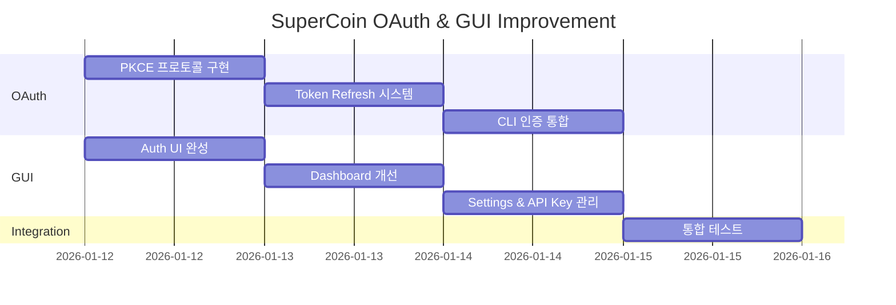

# SuperCoin GUI & OAuth 개선 마스터 플랜

> **작성일**: 2026-01-12
> **목표**: OpenCode 수준의 GUI 및 OAuth 인증 플로우 구현
> **방식**: 멀티 에이전트 워크플로우 (Claude Code + Gemini CLI)

---

## Executive Summary

SuperCoin의 현재 구현은 기본적인 OAuth 플로우를 지원하지만, OpenCode 수준의 프로덕션 레벨 기능이 부족합니다. 이 계획은 다음을 목표로 합니다:

1. **OAuth 보안 강화**: PKCE 프로토콜 도입
2. **토큰 관리 개선**: Refresh Token + 자동 갱신
3. **GUI 개선**: Web Console 완성도 향상
4. **CLI 통합**: Web Console ↔ CLI 인증 연동

---

## Gap Analysis Summary

### OAuth 인증 (Critical)

| 기능 | SuperCode | OpenCode | 우선순위 |
|------|-----------|----------|----------|
| PKCE 프로토콜 | ❌ | ✓ | **CRITICAL** |
| Token Refresh | ❌ | ✓ | **CRITICAL** |
| Refresh Token 저장 | ❌ | ✓ | **HIGH** |
| 만료 버퍼 (60초) | ❌ | ✓ | HIGH |
| 재시도 로직 (Exponential Backoff) | ❌ | ✓ | HIGH |
| Invalid Grant 감지 | ❌ | ✓ | HIGH |
| 로컬 Callback 서버 | ❌ | ✓ | HIGH |
| 동적 포트 바인딩 | ❌ | ✓ | MEDIUM |

### GUI (Web Console)

| 기능 | 현재 상태 | 목표 | 우선순위 |
|------|-----------|------|----------|
| Dashboard | 기본 구조 | 완전한 통계 | HIGH |
| Auth UI | 기본 라우트 | 완전한 로그인 플로우 | **CRITICAL** |
| Settings | 기본 페이지 | API Key 관리 포함 | HIGH |
| Models Page | Select UI | 프로바이더별 설정 | MEDIUM |
| Dark Mode | 기본 구현 | 완전한 테마 시스템 | MEDIUM |

---

## Phase 구조



---

## Phase 1: OAuth 보안 강화 (CRITICAL)

### 1.1 PKCE 프로토콜 구현

**파일**: `packages/auth/src/pkce.ts`

```typescript
import { createHash, randomBytes } from "crypto";

export interface PKCEPair {
  verifier: string;
  challenge: string;
  method: "S256";
}

export function generatePKCEPair(): PKCEPair {
  // 43-128 characters, URL-safe base64
  const verifier = randomBytes(32).toString("base64url");

  // SHA256 hash of verifier
  const challenge = createHash("sha256")
    .update(verifier)
    .digest("base64url");

  return {
    verifier,
    challenge,
    method: "S256",
  };
}

export interface OAuthState {
  verifier: string;
  projectId?: string;
  timestamp: number;
}

export function encodeState(state: OAuthState): string {
  return Buffer.from(JSON.stringify(state)).toString("base64url");
}

export function decodeState(encoded: string): OAuthState | null {
  try {
    const json = Buffer.from(encoded, "base64url").toString("utf8");
    return JSON.parse(json);
  } catch {
    return null;
  }
}
```

### 1.2 Token Refresh 시스템

**파일**: `packages/auth/src/token.ts`

```typescript
export interface TokenSet {
  access_token: string;
  refresh_token: string;
  expires_in: number;
  timestamp: number;
  token_type: "Bearer";
}

export interface TokenRefreshConfig {
  refreshBufferMs: number;  // 60000 (60초)
  maxRetries: number;       // 3
  baseDelayMs: number;      // 1000
}

const DEFAULT_CONFIG: TokenRefreshConfig = {
  refreshBufferMs: 60_000,
  maxRetries: 3,
  baseDelayMs: 1000,
};

export function isTokenExpired(
  tokens: TokenSet,
  config: TokenRefreshConfig = DEFAULT_CONFIG
): boolean {
  const expirationTime = tokens.timestamp + tokens.expires_in * 1000;
  return Date.now() >= expirationTime - config.refreshBufferMs;
}

export async function refreshAccessToken(
  refreshToken: string,
  clientId: string,
  clientSecret: string,
  config: TokenRefreshConfig = DEFAULT_CONFIG
): Promise<TokenSet> {
  let lastError: Error | undefined;

  for (let attempt = 0; attempt <= config.maxRetries; attempt++) {
    try {
      const response = await fetch("https://github.com/login/oauth/access_token", {
        method: "POST",
        headers: {
          Accept: "application/json",
          "Content-Type": "application/json",
        },
        body: JSON.stringify({
          client_id: clientId,
          client_secret: clientSecret,
          grant_type: "refresh_token",
          refresh_token: refreshToken,
        }),
      });

      if (!response.ok) {
        const error = await response.json();
        if (error.error === "invalid_grant") {
          throw new InvalidGrantError("Token has been revoked");
        }
        throw new Error(error.error_description || error.error);
      }

      const data = await response.json();
      return {
        access_token: data.access_token,
        refresh_token: data.refresh_token || refreshToken,
        expires_in: data.expires_in || 28800,
        timestamp: Date.now(),
        token_type: "Bearer",
      };
    } catch (error) {
      lastError = error as Error;

      if (error instanceof InvalidGrantError) {
        throw error; // Don't retry invalid grants
      }

      if (attempt < config.maxRetries) {
        const delay = config.baseDelayMs * Math.pow(2, attempt);
        await new Promise((resolve) => setTimeout(resolve, delay));
      }
    }
  }

  throw lastError || new Error("Token refresh failed");
}

export class InvalidGrantError extends Error {
  constructor(message: string) {
    super(message);
    this.name = "InvalidGrantError";
  }
}
```

### 1.3 수정할 라우트

**파일**: `packages/auth/src/routes/authorize.ts`

```typescript
import { Hono } from "hono";
import { generatePKCEPair, encodeState, type OAuthState } from "../pkce";
import type { AuthConfig } from "../types";

export function createAuthorizeRoute(config: AuthConfig) {
  const app = new Hono();

  app.get("/authorize", async (c) => {
    const pkce = generatePKCEPair();
    const redirectUri = `${process.env.AUTH_BASE_URL}/auth/callback`;

    const state: OAuthState = {
      verifier: pkce.verifier,
      timestamp: Date.now(),
    };

    const encodedState = encodeState(state);

    // Store verifier in cookie (HttpOnly, secure)
    c.header(
      "Set-Cookie",
      `pkce_verifier=${pkce.verifier}; HttpOnly; SameSite=Lax; Path=/; Max-Age=600; Secure`
    );

    const authUrl = new URL("https://github.com/login/oauth/authorize");
    authUrl.searchParams.set("client_id", config.githubClientId);
    authUrl.searchParams.set("redirect_uri", redirectUri);
    authUrl.searchParams.set("scope", "read:user user:email");
    authUrl.searchParams.set("state", encodedState);
    // Note: GitHub OAuth doesn't support PKCE natively,
    // but we use the verifier for internal CSRF protection

    return c.redirect(authUrl.toString());
  });

  return app;
}
```

---

## Phase 2: GUI 개선

### 2.1 Auth UI 컴포넌트

**파일**: `packages/console/app/src/routes/auth/login.tsx`

```tsx
import { Component, Show } from "solid-js";
import { useNavigate } from "@solidjs/router";
import { Button } from "@supercoin/ui/button";
import { Card } from "@supercoin/ui/card";

export default function LoginPage() {
  const navigate = useNavigate();

  const handleGitHubLogin = () => {
    window.location.href = "/auth/authorize";
  };

  return (
    <div class="flex min-h-screen items-center justify-center bg-background">
      <Card class="w-full max-w-md p-8">
        <div class="text-center">
          <h1 class="mb-2 text-2xl font-bold">Welcome to SuperCoin</h1>
          <p class="mb-6 text-muted-foreground">
            Sign in to access your AI coding assistant
          </p>
        </div>

        <div class="space-y-4">
          <Button
            class="w-full"
            onClick={handleGitHubLogin}
          >
            <svg class="mr-2 h-5 w-5" fill="currentColor" viewBox="0 0 20 20">
              <path fill-rule="evenodd" d="M10 0C4.477 0 0 4.484 0 10.017c0 4.425 2.865 8.18 6.839 9.504.5.092.682-.217.682-.483 0-.237-.008-.868-.013-1.703-2.782.605-3.369-1.343-3.369-1.343-.454-1.158-1.11-1.466-1.11-1.466-.908-.62.069-.608.069-.608 1.003.07 1.531 1.032 1.531 1.032.892 1.53 2.341 1.088 2.91.832.092-.647.35-1.088.636-1.338-2.22-.253-4.555-1.113-4.555-4.951 0-1.093.39-1.988 1.029-2.688-.103-.253-.446-1.272.098-2.65 0 0 .84-.27 2.75 1.026A9.564 9.564 0 0110 4.844c.85.004 1.705.115 2.504.337 1.909-1.296 2.747-1.027 2.747-1.027.546 1.379.203 2.398.1 2.651.64.7 1.028 1.595 1.028 2.688 0 3.848-2.339 4.695-4.566 4.942.359.31.678.921.678 1.856 0 1.338-.012 2.419-.012 2.747 0 .268.18.58.688.482A10.019 10.019 0 0020 10.017C20 4.484 15.522 0 10 0z" clip-rule="evenodd" />
            </svg>
            Continue with GitHub
          </Button>

          <div class="relative">
            <div class="absolute inset-0 flex items-center">
              <span class="w-full border-t" />
            </div>
            <div class="relative flex justify-center text-xs uppercase">
              <span class="bg-background px-2 text-muted-foreground">
                Or continue with
              </span>
            </div>
          </div>

          <Button
            variant="outline"
            class="w-full"
            onClick={() => navigate("/auth/api-key")}
          >
            API Key
          </Button>
        </div>

        <p class="mt-6 text-center text-xs text-muted-foreground">
          By signing in, you agree to our Terms of Service and Privacy Policy
        </p>
      </Card>
    </div>
  );
}
```

### 2.2 API Key 관리 페이지

**파일**: `packages/console/app/src/routes/settings/api-keys.tsx`

```tsx
import { Component, For, createSignal, createResource } from "solid-js";
import { Button } from "@supercoin/ui/button";
import { Card } from "@supercoin/ui/card";
import { Input } from "@supercoin/ui/input";
import { Dialog, DialogContent, DialogHeader, DialogTitle, DialogTrigger } from "@supercoin/ui/dialog";
import { Navbar } from "~/components/layout/navbar";
import { Sidebar } from "~/components/layout/sidebar";

interface APIKey {
  id: string;
  name: string;
  prefix: string;
  createdAt: string;
  lastUsedAt: string | null;
}

async function fetchAPIKeys(): Promise<APIKey[]> {
  const response = await fetch("/api/keys");
  return response.json();
}

export default function APIKeysPage() {
  const [keys, { refetch }] = createResource(fetchAPIKeys);
  const [newKeyName, setNewKeyName] = createSignal("");
  const [createdKey, setCreatedKey] = createSignal<string | null>(null);

  const createKey = async () => {
    const response = await fetch("/api/keys", {
      method: "POST",
      headers: { "Content-Type": "application/json" },
      body: JSON.stringify({ name: newKeyName() }),
    });
    const data = await response.json();
    setCreatedKey(data.key);
    setNewKeyName("");
    refetch();
  };

  const deleteKey = async (id: string) => {
    await fetch(`/api/keys/${id}`, { method: "DELETE" });
    refetch();
  };

  return (
    <div class="flex min-h-screen flex-col">
      <Navbar />
      <div class="flex flex-1">
        <Sidebar />
        <main class="flex-1 p-6">
          <div class="mb-6 flex items-center justify-between">
            <h1 class="text-3xl font-bold">API Keys</h1>
            <Dialog>
              <DialogTrigger as={Button}>Create New Key</DialogTrigger>
              <DialogContent>
                <DialogHeader>
                  <DialogTitle>Create API Key</DialogTitle>
                </DialogHeader>
                <div class="space-y-4 py-4">
                  <div>
                    <label class="mb-2 block text-sm font-medium">Key Name</label>
                    <Input
                      value={newKeyName()}
                      onInput={(e) => setNewKeyName(e.currentTarget.value)}
                      placeholder="My API Key"
                    />
                  </div>
                  <Button onClick={createKey} class="w-full">
                    Create Key
                  </Button>
                </div>
              </DialogContent>
            </Dialog>
          </div>

          {createdKey() && (
            <Card class="mb-6 border-green-500 bg-green-50 p-4 dark:bg-green-900/20">
              <p class="mb-2 font-medium text-green-800 dark:text-green-200">
                API Key Created Successfully!
              </p>
              <p class="mb-2 text-sm text-green-600 dark:text-green-300">
                Make sure to copy your key now. You won't be able to see it again.
              </p>
              <code class="block rounded bg-green-100 p-2 font-mono text-sm dark:bg-green-800">
                {createdKey()}
              </code>
              <Button
                variant="outline"
                size="sm"
                class="mt-2"
                onClick={() => {
                  navigator.clipboard.writeText(createdKey()!);
                  setCreatedKey(null);
                }}
              >
                Copy & Close
              </Button>
            </Card>
          )}

          <Card class="p-6">
            <table class="w-full">
              <thead>
                <tr class="border-b text-left">
                  <th class="pb-3 font-medium">Name</th>
                  <th class="pb-3 font-medium">Key</th>
                  <th class="pb-3 font-medium">Created</th>
                  <th class="pb-3 font-medium">Last Used</th>
                  <th class="pb-3 font-medium">Actions</th>
                </tr>
              </thead>
              <tbody>
                <For each={keys() ?? []}>
                  {(key) => (
                    <tr class="border-b">
                      <td class="py-3">{key.name}</td>
                      <td class="py-3">
                        <code class="rounded bg-muted px-2 py-1 text-sm">
                          {key.prefix}...
                        </code>
                      </td>
                      <td class="py-3 text-sm text-muted-foreground">
                        {new Date(key.createdAt).toLocaleDateString()}
                      </td>
                      <td class="py-3 text-sm text-muted-foreground">
                        {key.lastUsedAt
                          ? new Date(key.lastUsedAt).toLocaleDateString()
                          : "Never"}
                      </td>
                      <td class="py-3">
                        <Button
                          variant="destructive"
                          size="sm"
                          onClick={() => deleteKey(key.id)}
                        >
                          Delete
                        </Button>
                      </td>
                    </tr>
                  )}
                </For>
              </tbody>
            </table>
          </Card>
        </main>
      </div>
    </div>
  );
}
```

---

## Phase 3: CLI 인증 통합

### 3.1 로컬 Callback 서버

**파일**: `src/services/auth/callback-server.ts`

```typescript
export interface CallbackResult {
  code: string;
  state: string;
}

export interface CallbackServerHandle {
  port: number;
  waitForCallback: () => Promise<CallbackResult>;
  close: () => void;
}

export function startCallbackServer(
  timeoutMs: number = 5 * 60 * 1000
): CallbackServerHandle {
  let resolveCallback: (result: CallbackResult) => void;
  let rejectCallback: (error: Error) => void;

  const callbackPromise = new Promise<CallbackResult>((resolve, reject) => {
    resolveCallback = resolve;
    rejectCallback = reject;
  });

  const server = Bun.serve({
    port: 0, // Dynamic port
    fetch(request: Request): Response {
      const url = new URL(request.url);

      if (url.pathname === "/oauth-callback") {
        const code = url.searchParams.get("code");
        const state = url.searchParams.get("state");
        const error = url.searchParams.get("error");

        if (error) {
          rejectCallback(new Error(error));
          return new Response(
            "<html><body><h1>Authentication Failed</h1><p>You can close this window.</p></body></html>",
            { headers: { "Content-Type": "text/html" } }
          );
        }

        if (code && state) {
          resolveCallback({ code, state });
          return new Response(
            "<html><body><h1>Authentication Successful!</h1><p>You can close this window and return to the terminal.</p></body></html>",
            { headers: { "Content-Type": "text/html" } }
          );
        }

        return new Response("Missing parameters", { status: 400 });
      }

      return new Response("Not Found", { status: 404 });
    },
  });

  const timeout = setTimeout(() => {
    rejectCallback(new Error("Authentication timed out"));
    server.stop();
  }, timeoutMs);

  return {
    port: server.port,
    waitForCallback: async () => {
      const result = await callbackPromise;
      clearTimeout(timeout);
      return result;
    },
    close: () => {
      clearTimeout(timeout);
      server.stop();
    },
  };
}
```

### 3.2 CLI Auth Command 개선

**파일**: `src/cli/commands/auth.ts` (수정)

```typescript
import { startCallbackServer } from "../../services/auth/callback-server";
import { generatePKCEPair, encodeState } from "@supercoin/auth/pkce";

export async function loginWithGitHub(): Promise<void> {
  const spinner = clack.spinner();

  // Start local callback server
  const server = startCallbackServer();
  const redirectUri = `http://localhost:${server.port}/oauth-callback`;

  // Generate PKCE
  const pkce = generatePKCEPair();
  const state = encodeState({
    verifier: pkce.verifier,
    timestamp: Date.now(),
  });

  // Build auth URL
  const authUrl = new URL("https://github.com/login/oauth/authorize");
  authUrl.searchParams.set("client_id", GITHUB_CLIENT_ID);
  authUrl.searchParams.set("redirect_uri", redirectUri);
  authUrl.searchParams.set("scope", "read:user user:email");
  authUrl.searchParams.set("state", state);

  clack.log.info("Opening browser for GitHub authentication...");

  // Open browser
  const open = (await import("open")).default;
  await open(authUrl.toString());

  spinner.start("Waiting for authentication...");

  try {
    const callback = await server.waitForCallback();

    // Verify state
    const decodedState = decodeState(callback.state);
    if (!decodedState || decodedState.verifier !== pkce.verifier) {
      throw new Error("Invalid state - possible CSRF attack");
    }

    // Exchange code for token
    const tokens = await exchangeCodeForTokens(
      callback.code,
      redirectUri,
      GITHUB_CLIENT_ID,
      GITHUB_CLIENT_SECRET
    );

    // Store tokens securely
    await storeTokens(tokens);

    spinner.stop("Successfully authenticated!");
    clack.log.success("You are now logged in.");
  } catch (error) {
    spinner.stop("Authentication failed");
    clack.log.error((error as Error).message);
  } finally {
    server.close();
  }
}
```

---

## Work Plan

### Day 1: OAuth 보안 강화

| Task | 시간 | 담당 |
|------|------|------|
| PKCE 모듈 구현 | 2h | Claude Code |
| Token Refresh 시스템 구현 | 3h | Claude Code |
| 라우트 수정 (authorize, callback) | 2h | Claude Code |
| 테스트 작성 | 1h | Claude Code |

### Day 2: GUI 개선

| Task | 시간 | 담당 |
|------|------|------|
| Login 페이지 구현 | 2h | Claude Code |
| API Key 관리 페이지 구현 | 3h | Claude Code |
| Auth Context 개선 | 1h | Claude Code |
| 스타일 및 테마 조정 | 2h | Claude Code |

### Day 3: CLI 통합 & 테스트

| Task | 시간 | 담당 |
|------|------|------|
| Callback 서버 구현 | 2h | Claude Code |
| CLI Auth Command 개선 | 2h | Claude Code |
| 통합 테스트 | 2h | Claude Code |
| 문서 업데이트 | 1h | Claude Code |

---

## Verification Checklist

### OAuth
- [ ] PKCE 프로토콜이 authorize에서 생성됨
- [ ] State가 Base64URL로 인코딩됨
- [ ] Callback에서 verifier 검증이 수행됨
- [ ] Token refresh가 만료 60초 전에 동작함
- [ ] Invalid grant 에러가 적절히 처리됨
- [ ] 재시도 로직이 exponential backoff로 동작함

### GUI
- [ ] Login 페이지가 /auth/login에서 렌더링됨
- [ ] GitHub 버튼이 OAuth 플로우를 시작함
- [ ] API Key 페이지에서 키 생성/삭제가 동작함
- [ ] 다크/라이트 테마가 올바르게 전환됨

### CLI
- [ ] `supercoin auth login` 명령이 브라우저를 열음
- [ ] 로컬 callback 서버가 동적 포트에서 시작됨
- [ ] 인증 성공 후 토큰이 저장됨
- [ ] 인증 실패 시 적절한 에러 메시지가 표시됨

---

## Risk Mitigation

| Risk | Impact | Mitigation |
|------|--------|------------|
| GitHub PKCE 미지원 | Medium | 내부 CSRF 보호로 대체, verifier 쿠키 사용 |
| Token 저장 보안 | High | OS Keychain 사용 (macOS: Keychain, Linux: libsecret) |
| Callback 서버 포트 충돌 | Low | 동적 포트 (port: 0) 사용 |
| 브라우저 미열림 | Medium | 수동 URL 복사 옵션 제공 |

---

## Dependencies

### 새로 추가할 패키지

```json
{
  "dependencies": {
    "keytar": "^7.9.0",  // OS keychain access
    "open": "^10.0.0"    // Open browser
  }
}
```

---

**Generated by**: Multi-Agent Workflow (Claude Code + Gemini CLI)
**Date**: 2026-01-12
